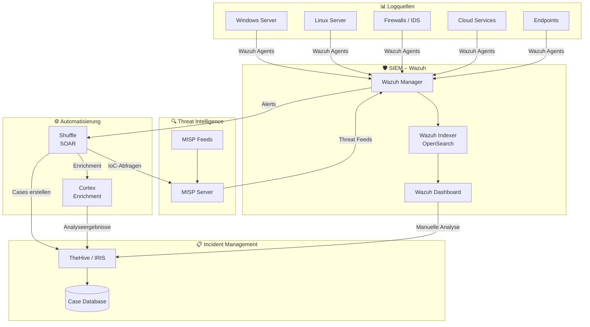
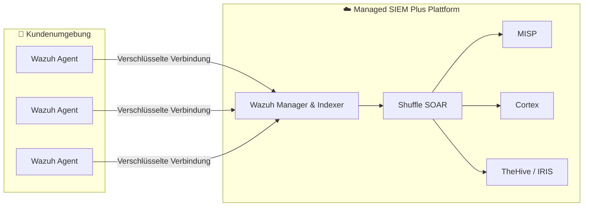

# Systemarchitektur

## Gesamtarchitektur

Die folgende Darstellung zeigt, wie alle Komponenten unseres Blue Team Operations Stack zusammenwirken:



---

## Datenfluss

### 1. Datensammlung (Ingestion)

```
Logquellen → Wazuh Agents → Wazuh Manager → Wazuh Indexer (OpenSearch)
```

- **Wazuh Agents** werden auf allen zu überwachenden Systemen installiert
- Agenten senden Logs verschlüsselt an den **Wazuh Manager**
- Der Manager wendet **Regeln und Decoder** an und speichert Events im **Indexer**

### 2. Erkennung (Detection)

```
Wazuh Rules + MISP IoCs → Alert-Generierung → Priorisierung
```

- Wazuh wertet Events gegen tausende vordefinierte und kundenspezifische **Regeln** aus
- **MISP** liefert aktuelle Indicators of Compromise (IoCs) für die Erkennung
- Alerts werden nach **Schweregrad** (1–15) priorisiert

### 3. Automatisierung (Orchestration)

```
Alert → Shuffle Workflow → Cortex Enrichment → Entscheidung
```

- **Shuffle** empfängt Alerts und startet automatisierte **Playbooks**
- **Cortex** reichert verdächtige Indikatoren (IPs, Hashes, Domains) mit externen Daten an
- Basierend auf Ergebnissen: automatische Aktion oder Eskalation an Analysten

### 4. Incident Management

```
Validierter Alert → TheHive/IRIS Case → Analyse → Response → Abschluss
```

- Bestätigte Vorfälle werden als **Cases** in TheHive/IRIS erstellt
- Analysten dokumentieren Analyse, Maßnahmen und Ergebnisse
- Abgeschlossene Cases fließen als **Learnings** zurück ins System

---

## Netzwerk & Kommunikation

| Von | Nach | Protokoll | Zweck |
|---|---|---|---|
| Wazuh Agent | Wazuh Manager | TCP 1514 (verschlüsselt) | Log-Übertragung |
| Wazuh Manager | Wazuh Indexer | HTTPS 9200 | Event-Speicherung |
| Wazuh Manager | Shuffle | Webhook (HTTPS) | Alert-Weiterleitung |
| Shuffle | MISP | REST API (HTTPS) | IoC-Abfragen |
| Shuffle | Cortex | REST API (HTTPS) | Enrichment-Anfragen |
| Shuffle | TheHive/IRIS | REST API (HTTPS) | Case-Erstellung |
| Cortex | TheHive/IRIS | REST API (HTTPS) | Analyseergebnisse |
| MISP | Wazuh Manager | REST API (HTTPS) | Threat Feed Integration |

---

## Deployment-Modell

!!! note "Managed Service"
    Im Rahmen unseres **SIEM Plus** Managed Service betreiben wir die gesamte Infrastruktur für Sie. Lediglich die **Wazuh Agents** werden in Ihrer Umgebung installiert.



---

## Nächste Schritte

Erfahren Sie mehr über die einzelnen Systeme:

- [SIEM – Wazuh](systeme/siem-wazuh.md)
- [IMS – TheHive / IRIS](systeme/ims-thehive-iris.md)
- [TIPL – MISP](systeme/tipl-misp.md)
- [SOAR – Shuffle](systeme/soar-shuffle.md)
- [Cortex](systeme/cortex.md)
