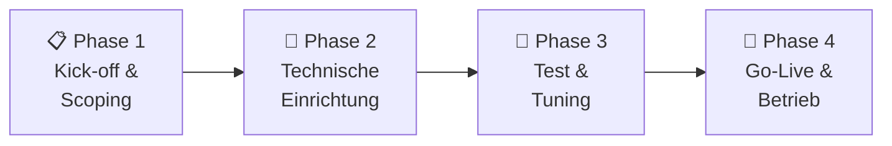

# Onboarding – SIEM Plus

## Überblick

Das Onboarding für den **SIEM Plus** Managed Service ist ein strukturierter Prozess, der Sie schnell und sicher in den operativen Betrieb bringt.

---

## Onboarding-Phasen

---

### Phase 1 – Kick-off & Scoping

| Aktivität | Details |
|---|---|
| **Kick-off Meeting** | Vorstellung des Teams, Zeitplan und Kommunikationswege |
| **Scope-Definition** | Welche Systeme und Logquellen sollen überwacht werden? |
| **Netzwerk-Analyse** | Prüfung der Netzwerk-Voraussetzungen |
| **Ansprechpartner** | Festlegung der Kontaktpersonen beider Seiten |
| **SLA-Vereinbarung** | Definition der Service-Level und Eskalationswege |

**Ergebnis:** Dokumentierter Scope und Projektplan

---

### Phase 2 – Technische Einrichtung

| Aktivität | Details |
|---|---|
| **Plattform-Setup** | Einrichtung Ihrer dedizierten SIEM Plus Umgebung |
| **Agent-Rollout** | Installation der Wazuh Agents auf Ihren Systemen |
| **Log-Integration** | Anbindung zusätzlicher Logquellen (Firewalls, Cloud, etc.) |
| **Basis-Regelwerk** | Aktivierung des Standard-Regelwerks |
| **Dashboard-Setup** | Einrichtung kundenspezifischer Dashboards |
| **Zugänge** | Bereitstellung Ihrer Zugangsdaten zum Dashboard |

**Ergebnis:** Funktionsfähige SIEM Plus Plattform mit eingehenden Daten

---

### Phase 3 – Test & Tuning

| Aktivität | Details |
|---|---|
| **Testbetrieb** | Überwachung der eingehenden Alerts im Parallelbetrieb |
| **False Positive Tuning** | Anpassung der Regeln um Fehlalarme zu reduzieren |
| **Custom Rules** | Erstellung kundenspezifischer Erkennungsregeln |
| **Playbook-Anpassung** | Konfiguration der automatisierten Workflows |
| **Validierung** | Prüfung aller Integrationen und Datenflüsse |

**Ergebnis:** Optimierte Konfiguration mit minimalen False Positives

---

### Phase 4 – Go-Live & Übergang in Betrieb

| Aktivität | Details |
|---|---|
| **Go-Live** | Aktivierung des produktiven Monitorings |
| **Schulung** | Einweisung Ihres Teams in Dashboard und Prozesse |
| **Dokumentation** | Übergabe der Betriebsdokumentation |
| **Review** | Erstes Review nach 4 Wochen Betrieb |

**Ergebnis:** Vollständig operativer SIEM Plus Managed Service

---

## Voraussetzungen auf Kundenseite

!!! note "Checkliste"
    - [ ] Technischer Ansprechpartner benannt
    - [ ] Netzwerk-Freigaben eingerichtet (TCP 1514 ausgehend)
    - [ ] Liste der zu überwachenden Systeme bereitgestellt
    - [ ] Administrativer Zugang für Agent-Installation vorhanden
    - [ ] Kontaktdaten für Eskalationen hinterlegt

---

## Zeitrahmen

| Phase | Dauer (typisch) |
|---|---|
| Phase 1 – Kick-off & Scoping | 1 Woche |
| Phase 2 – Technische Einrichtung | 1–2 Wochen |
| Phase 3 – Test & Tuning | 2–4 Wochen |
| Phase 4 – Go-Live | 1 Woche |
| **Gesamt** | **5–8 Wochen** |

---

## Weiterführende Links

- [SIEM Plus Service](siem-plus.md) – Leistungsumfang im Detail
- [Systemarchitektur](../architektur.md) – Technische Gesamtübersicht
