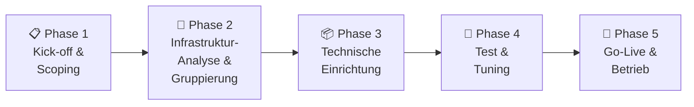
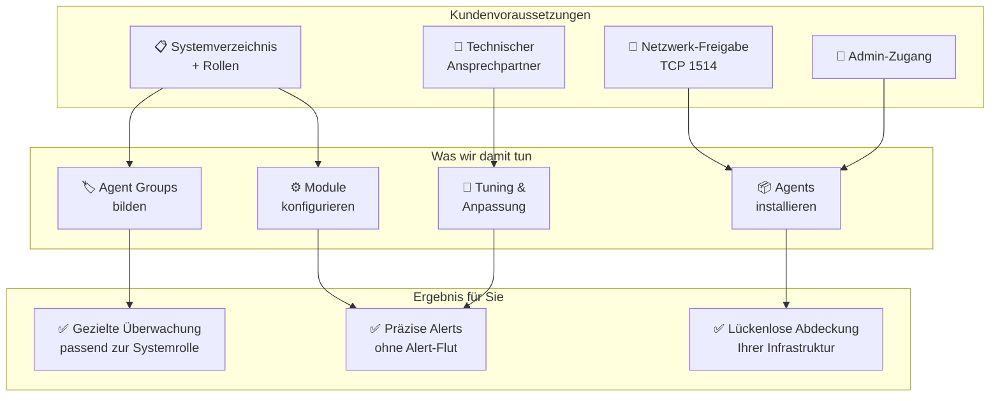

# Onboarding – SIEM Plus

## Überblick

Das Onboarding für den **SIEM Plus** Managed Service ist ein strukturierter Prozess, der Sie schnell und sicher in den operativen Betrieb bringt. Dabei arbeiten wir eng mit Ihnen zusammen – denn die Qualität der Überwachung hängt direkt davon ab, wie gut wir Ihre Infrastruktur verstehen.

!!! info "Kerngedanke"
    Jede Voraussetzung, die wir von Ihnen benötigen, hat einen konkreten Grund. Auf dieser Seite erklären wir nicht nur **was** wir brauchen, sondern auch **warum** – damit Sie den Zusammenhang zwischen Ihrem Input und dem Ergebnis nachvollziehen können.

---

## Onboarding-Phasen


```mermaid
graph LR
    P1["📋 Phase 1<br/>Kick-off &<br/>Scoping"] --> P2["🔧 Phase 2<br/>Infrastruktur-<br/>Analyse &<br/>Gruppierung"]
    P2 --> P3["📦 Phase 3<br/>Technische<br/>Einrichtung"]
    P3 --> P4["🧪 Phase 4<br/>Test &<br/>Tuning"]
    P4 --> P5["🚀 Phase 5<br/>Go-Live &<br/>Betrieb"]
```

---

### Phase 1 – Kick-off & Scoping

| Aktivität | Details |
|---|---|
| **Kick-off Meeting** | Vorstellung des Teams, Zeitplan und Kommunikationswege |
| **Scope-Definition** | Welche Systeme und Logquellen sollen überwacht werden? |
| **Netzwerk-Analyse** | Prüfung der Netzwerk-Voraussetzungen (TCP 1514 ausgehend) |
| **Ansprechpartner** | Festlegung der Kontaktpersonen beider Seiten |
| **SLA-Vereinbarung** | Definition der Service-Level und Eskalationswege |

**Ergebnis:** Dokumentierter Scope und Projektplan

---

### Phase 2 – Infrastruktur-Analyse & Gruppierung

!!! tip "Neue Phase – Warum?"
    Diese Phase ist entscheidend für die Qualität Ihrer Überwachung. Hier legen wir gemeinsam fest, wie Ihre Systeme gruppiert und welche Module aktiviert werden. Mehr dazu unter [Agent Groups](../systeme/siem-wazuh.md#agent-groups-das-zentrale-konfigurationskonzept).

| Aktivität | Details | Warum? |
|---|---|---|
| **Systeminventar** | Erfassung aller Systeme mit Hostname, OS und Rolle | Ohne Inventar wissen wir nicht, **welche** Systeme überwacht werden müssen |
| **Rollen-Zuordnung** | Klassifizierung: DC, Webserver, DB, Endpoint, Netzwerk, … | Die Rolle bestimmt, welche **Module** (FIM, SCA, Rootkit, …) aktiviert werden |
| **Agent Groups definieren** | Systeme mit gleicher Rolle → gleiche Gruppe | Ermöglicht **gezielte Konfiguration** statt Einheitsbrei |
| **Modulplanung pro Gruppe** | Festlegung der Module und Regeln je Gruppe | Vermeidet **blinde Flecken** und **Alert-Flut** gleichzeitig |
| **Kritikalitätsbewertung** | Welche Systeme sind geschäftskritisch? | Steuert **Alert-Prioritäten** und **Eskalationswege** |
| **Netzwerk-Segmente dokumentieren** | In welchen Netzen stehen die Systeme? | Basis für Regeln zur Erkennung **lateraler Bewegungen** |

**Ergebnis:** Dokumentierte Agent-Group-Struktur mit Modulkonfiguration pro Gruppe

#### Beispiel-Ergebnis dieser Phase

```
Agent Groups:
├── domain-controllers (2 Systeme)
│   └── Module: Log Analysis, FIM, SCA (CIS Windows), Vuln Detection
├── webservers-linux (3 Systeme)
│   └── Module: Log Analysis, FIM, Rootkit Detection, SCA (CIS Ubuntu), Active Response
├── databases (1 System)
│   └── Module: Log Analysis, FIM, SCA (CIS PostgreSQL), Vuln Detection
├── endpoints-win (50 Systeme)
│   └── Module: Log Analysis, SCA (CIS Windows), Vuln Detection
└── Syslog-Input: Firewall (1 Gerät)
    └── Firewall-Logs via Syslog
```

---

### Phase 3 – Technische Einrichtung

| Aktivität | Details | Warum? |
|---|---|---|
| **Plattform-Setup** | Einrichtung Ihrer dedizierten SIEM Plus Umgebung | Dedizierte Instanz für Ihre Daten |
| **Agent Groups anlegen** | Konfiguration der Gruppen im Wazuh Manager | Basis für die modulare Konfiguration |
| **Agent-Rollout** | Installation der Wazuh Agents auf Ihren Systemen | Der Agent sammelt die Daten direkt auf dem System |
| **Gruppenzuweisung** | Jeder Agent wird seiner definierten Gruppe zugewiesen | Nur so erhält jedes System die **richtige Konfiguration** |
| **Log-Integration** | Anbindung zusätzlicher Logquellen (Firewalls, Cloud, etc.) | Netzwerkgeräte senden Logs direkt per Syslog |
| **Dashboard-Setup** | Einrichtung gruppenspezifischer Dashboards | Übersicht pro Systemrolle statt unstrukturierter Datenmasse |
| **Zugänge** | Bereitstellung Ihrer Zugangsdaten zum Dashboard | Ihr direkter Zugang zur Sicherheitslage |

**Ergebnis:** Funktionsfähige SIEM Plus Plattform mit eingehenden Daten und korrekter Gruppenzuordnung

---

### Phase 4 – Test & Tuning

| Aktivität | Details | Warum? |
|---|---|---|
| **Testbetrieb** | Überwachung der eingehenden Alerts im Parallelbetrieb | Validierung der Konfiguration unter Realbedingungen |
| **False Positive Tuning** | Anpassung der Regeln pro Gruppe | Jede Systemrolle erzeugt **andere** typische False Positives |
| **Custom Rules** | Erstellung kundenspezifischer Erkennungsregeln | Abdeckung Ihrer **individuellen** Bedrohungsszenarien |
| **Playbook-Anpassung** | Konfiguration der automatisierten Workflows in Shuffle | Automatisierte Reaktion auf Alerts aus verschiedenen Gruppen |
| **Validierung** | Prüfung: Werden alle relevanten Events erkannt? | Sicherstellung, dass keine **blinden Flecken** bestehen |

**Ergebnis:** Optimierte Konfiguration mit minimalen False Positives und maximaler Abdeckung

---

### Phase 5 – Go-Live & Übergang in Betrieb

| Aktivität | Details |
|---|---|
| **Go-Live** | Aktivierung des produktiven Monitorings |
| **Schulung** | Einweisung Ihres Teams in Dashboard, Agent-Gruppen und Prozesse |
| **Dokumentation** | Übergabe der Betriebsdokumentation inkl. Agent-Group-Übersicht |
| **Review** | Erstes Review nach 4 Wochen Betrieb – Anpassungen bei Bedarf |

**Ergebnis:** Vollständig operativer SIEM Plus Managed Service

---

## Voraussetzungen auf Kundenseite – und warum

Jede Voraussetzung dient einem konkreten Zweck im Onboarding-Prozess:

| Voraussetzung | Was genau? | Warum? | Benötigt in Phase |
|---|---|---|---|
| **Technischer Ansprechpartner** | Person mit Infrastruktur-Kenntnissen | Für Rückfragen zur Systemlandschaft und **Gruppenbildung** unverzichtbar | Phase 1–4 |
| **Systemverzeichnis** | Liste aller Systeme mit Hostname, OS und **Rolle** | Ohne Inventar können weder **Agent Groups** gebildet noch Module ausgewählt werden | Phase 2 |
| **Rollen-Zuordnung** | Funktion jedes Systems (DC, Webserver, DB, …) | Bestimmt die **Modulkonfiguration** – ein DC braucht andere Überwachung als ein Arbeitsplatz | Phase 2 |
| **Netzwerk-Freigabe TCP 1514** | Ausgehende Verbindung zu unserer Plattform | Der Agent muss seine Daten **verschlüsselt** an den Wazuh Manager übertragen können | Phase 3 |
| **Admin-Zugang** | Lokaler Admin / Root auf Zielsystemen | Agent muss als **Dienst installiert** werden und braucht Leserechte auf Logs | Phase 3 |
| **Kritikalitätsbewertung** | Welche Systeme sind geschäftskritisch? | Steuert **Alert-Prioritäten** – ein DC-Alert hat andere Dringlichkeit als ein Test-System | Phase 2 |
| **Eskalationskontakte** | Kontaktdaten für Vorfälle | Bei kritischen Alerts müssen wir Sie **schnell erreichen** können | Phase 1 |


```mermaid
graph TB
    subgraph "Kundenvoraussetzungen"
        V1["📋 Systemverzeichnis<br/>+ Rollen"]
        V2["🔌 Netzwerk-Freigabe<br/>TCP 1514"]
        V3["🔑 Admin-Zugang"]
        V4["👤 Technischer<br/>Ansprechpartner"]
    end

    subgraph "Was wir damit tun"
        A1["🏷️ Agent Groups<br/>bilden"]
        A2["⚙️ Module<br/>konfigurieren"]
        A3["📦 Agents<br/>installieren"]
        A4["🔧 Tuning &<br/>Anpassung"]
    end

    subgraph "Ergebnis für Sie"
        E1["✅ Gezielte Überwachung<br/>passend zur Systemrolle"]
        E2["✅ Präzise Alerts<br/>ohne Alert-Flut"]
        E3["✅ Lückenlose Abdeckung<br/>Ihrer Infrastruktur"]
    end

    V1 --> A1
    V1 --> A2
    V2 --> A3
    V3 --> A3
    V4 --> A4
    A1 --> E1
    A2 --> E2
    A3 --> E3
    A4 --> E2
```

---

## Zeitrahmen

| Phase | Dauer (typisch) |
|---|---|
| Phase 1 – Kick-off & Scoping | 1 Woche |
| Phase 2 – Infrastruktur-Analyse & Gruppierung | 1 Woche |
| Phase 3 – Technische Einrichtung | 1–2 Wochen |
| Phase 4 – Test & Tuning | 2–4 Wochen |
| Phase 5 – Go-Live | 1 Woche |
| **Gesamt** | **6–9 Wochen** |

---

## Weiterführende Links

- [SIEM – Wazuh](../systeme/siem-wazuh.md) – Agent Groups, Module und Konfigurationskonzept im Detail
- [SIEM Plus Service](siem-plus.md) – Leistungsumfang im Detail
- [Systemarchitektur](../architektur.md) – Technische Gesamtübersicht
