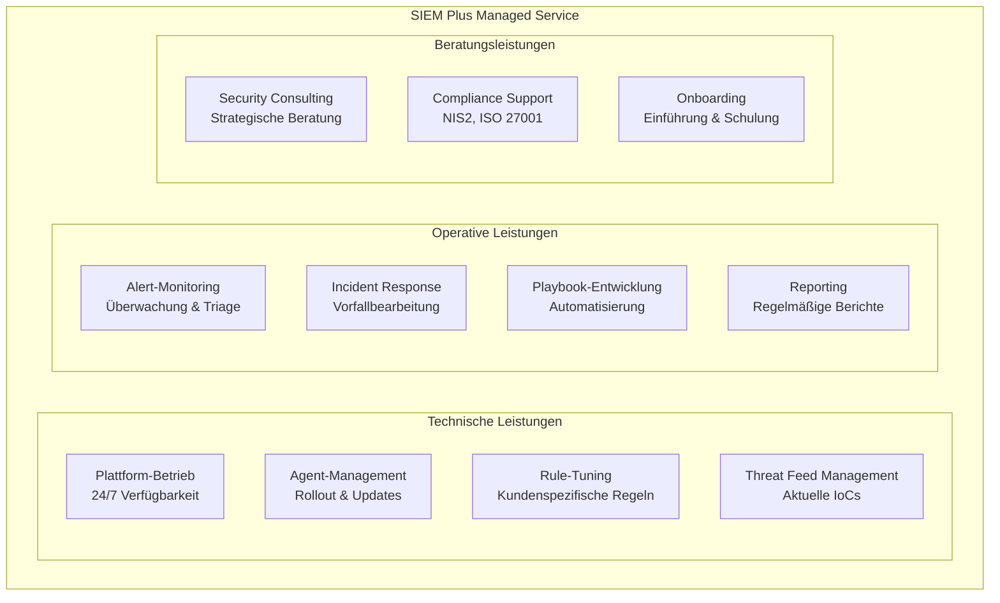
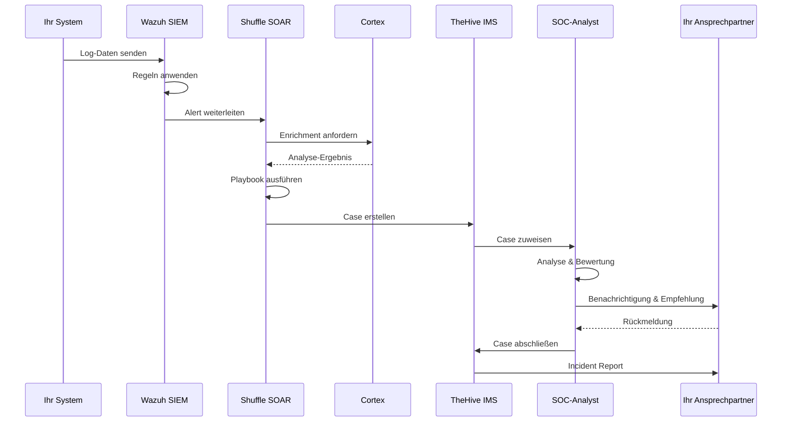

# Managed Service – SIEM Plus

## Überblick

**SIEM Plus** ist unser umfassender Managed Security Service, der auf der Open-Source-Plattform **Wazuh** basiert und durch die Integration von TheHive/IRIS, MISP, Shuffle und Cortex einen vollständigen Blue Team Operations Stack bietet.

!!! success "Der Vorteil für Sie"
    Mit SIEM Plus erhalten Sie ein **vollwertiges Security Operations Center (SOC)** – ohne die Komplexität und Kosten eines eigenen Aufbaus. Wir betreiben die Technik, Sie behalten den Überblick.

---

## Was ist im Service enthalten?

### Plattform-Komponenten

| Komponente | System | Im Service enthalten |
|---|---|---|
| **SIEM** | [Wazuh](../systeme/siem-wazuh.md) | ✅ Vollständig verwaltet |
| **Incident Management** | [TheHive / IRIS](../systeme/ims-thehive-iris.md) | ✅ Vollständig verwaltet |
| **Threat Intelligence** | [MISP](../systeme/tipl-misp.md) | ✅ Vollständig verwaltet |
| **Automatisierung** | [Shuffle](../systeme/soar-shuffle.md) | ✅ Vollständig verwaltet |
| **Enrichment** | [Cortex](../systeme/cortex.md) | ✅ Vollständig verwaltet |

### Service-Leistungen

---

## Service-Level

| Merkmal | Details |
|---|---|
| **Verfügbarkeit** | Plattform 24/7 verfügbar |
| **Monitoring** | Kontinuierliche Überwachung der Alerts |
| **Incident Response** | Reaktion gemäß vereinbartem SLA |
| **Updates** | Regelmäßige Plattform- und Regel-Updates |
| **Reporting** | Monatlicher Sicherheitsbericht |

---

## Was Sie bereitstellen

Für den SIEM Plus Service benötigen wir von Ihrer Seite:

| Aufgabe | Details |
|---|---|
| **Agent-Installation** | Wazuh Agents auf Ihren Systemen (wir unterstützen beim Rollout) |
| **Netzwerk-Freigaben** | Ausgehende Verbindung zum Wazuh Manager (TCP 1514) |
| **Ansprechpartner** | Technischer Kontakt für Rückfragen bei Vorfällen |
| **Log-Quellen** | Definition der zu überwachenden Systeme und Quellen |

---

## Ablauf eines typischen Sicherheitsvorfalls

---

## Mehrwert gegenüber Eigenbetrieb

| Aspekt | Eigenbetrieb | SIEM Plus |
|---|---|---|
| **Personalaufwand** | 3–5 SOC-Analysten nötig | Im Service enthalten |
| **Aufbauzeit** | 6–12 Monate | Wochen (Onboarding) |
| **Lizenzkosten** | Kommerzielle SIEM-Lizenzen | Open Source – keine Lizenzkosten |
| **Threat Intelligence** | Eigene Feeds beschaffen | Kuratierte Feeds inklusive |
| **Automatisierung** | Eigene Playbooks entwickeln | Bewährte Playbooks inklusive |
| **Know-how** | Eigenes Team aufbauen | Erfahrenes SOC-Team |
| **Skalierung** | Hardware & Lizenzen beschaffen | Flexibel skalierbar |

---

## Nächste Schritte

Interessiert an SIEM Plus? So geht es weiter:

1. **Erstgespräch** – Wir analysieren Ihre Anforderungen und IT-Landschaft
2. **Angebot** – Individuelles Angebot basierend auf Ihrem Scope
3. **[Onboarding](onboarding.md)** – Strukturierte Einführung in wenigen Wochen
4. **Betrieb** – Kontinuierlicher Managed Service

---

## Weiterführende Links

- [Onboarding-Prozess](onboarding.md) – So läuft die Einführung ab
- [Systemarchitektur](../architektur.md) – Technische Gesamtübersicht
- [Glossar](../glossar.md) – Fachbegriffe einfach erklärt
