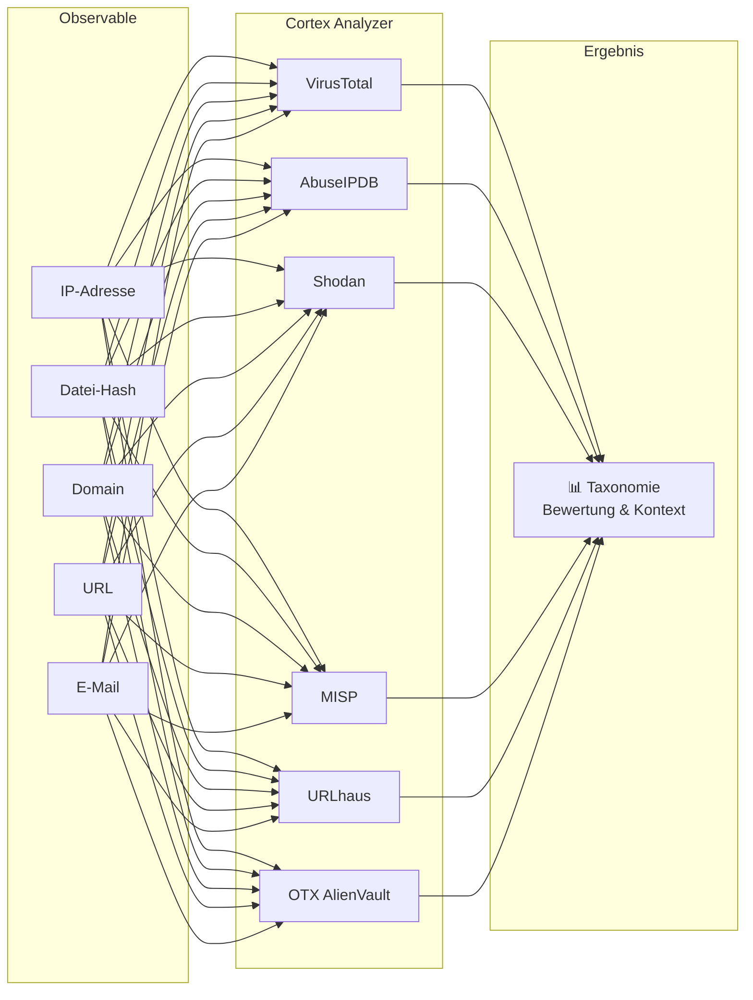
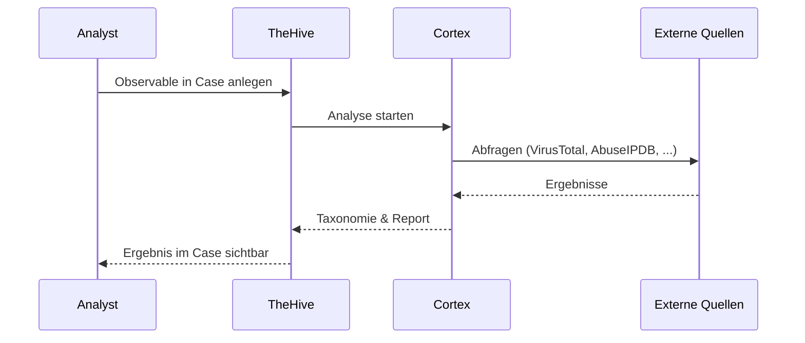

# Cortex – Enrichment & Response Engine

## Was ist Cortex?

**Cortex** ist eine leistungsstarke Analyse- und Response-Engine, die verdächtige Indikatoren (wie IP-Adressen, Datei-Hashes oder Domains) automatisch mit dutzenden externen Datenquellen abgleicht und analysiert.

!!! tip "Für Entscheidungsträger"
    Cortex ist wie ein **digitaler Forensik-Assistent** – wenn ein verdächtiger Hinweis auftaucht, prüft Cortex diesen automatisch gegen dutzende Datenbanken und liefert innerhalb von Sekunden eine fundierte Bewertung.

---

## Cortex im Überblick

| Eigenschaft | Details |
|---|---|
| **Typ** | Observable Analysis & Active Response Engine |
| **Lizenz** | Open Source (AGPL) |
| **Entwicklung** | StrangeBee (gleicher Hersteller wie TheHive) |
| **Stärken** | 150+ Analyzer, API-basiert, TheHive-Integration |
| **Einsatz** | Automatische Datenanreicherung und Reaktion |

---

## Kernfunktionen

### 1. Analyzer – Automatische Analyse

Cortex verfügt über **150+ Analyzer**, die verschiedene Observable-Typen gegen externe Quellen prüfen:

Häufig genutzte Analyzer:

| Analyzer | Prüft | Observable-Typ |
|---|---|---|
| **VirusTotal** | Malware-Reputation | Hashes, URLs, Domains, IPs |
| **AbuseIPDB** | IP-Reputation & Missbrauchsmeldungen | IP-Adressen |
| **Shodan** | Offene Dienste & Schwachstellen | IP-Adressen |
| **MISP** | Threat Intelligence Datenbank | Alle Typen |
| **URLhaus** | Bekannte Malware-URLs | URLs |
| **OTX AlienVault** | Threat Intelligence Community | Alle Typen |
| **Yara** | Pattern-basierte Datei-Analyse | Datei-Hashes |

### 2. Responder – Automatische Reaktion

Neben der Analyse kann Cortex auch aktiv reagieren:

- **Firewall-Updates** – Bösartige IPs blockieren
- **DNS-Sinkholing** – Schädliche Domains umleiten
- **Mail-Aktionen** – Phishing-Mails aus Postfächern entfernen
- **Endpoint-Aktionen** – Betroffene Systeme isolieren

### 3. Taxonomie & Bewertung

Analyse-Ergebnisse werden standardisiert als **Taxonomie** zurückgegeben:

| Level | Bedeutung | Beispiel |
|---|---|---|
| `info` | Informativ | „IP gehört zu AWS" |
| `safe` | Unbedenklich | „Hash ist bekannte Software" |
| `suspicious` | Verdächtig | „Domain erst 2 Tage alt" |
| `malicious` | Bösartig | „IP ist bekannter C2-Server" |

---

## Integration mit anderen Systemen

### Cortex ↔ TheHive (Primäre Integration)

Die engste Integration besteht mit **TheHive**:

- Observables in TheHive können **direkt** zur Analyse an Cortex gesendet werden
- Ergebnisse erscheinen als **Reports** im jeweiligen Case
- Auf Basis der Ergebnisse können **Responder** ausgelöst werden

### Cortex ↔ Shuffle (SOAR)

- Shuffle nutzt Cortex-Analyzer in **automatisierten Workflows**
- Enrichment-Ergebnisse fließen in die **Entscheidungslogik** von Playbooks

### Cortex ↔ MISP (TIPL)

- MISP dient als **Datenquelle** für den MISP-Analyzer in Cortex
- Cortex-Ergebnisse können als neue IoCs **nach MISP** zurückfließen

---

## Vorteile

| Aspekt | Vorteil |
|---|---|
| **Geschwindigkeit** | Parallele Analyse mit mehreren Quellen in Sekunden |
| **Konsistenz** | Standardisierte Bewertung durch Taxonomien |
| **Abdeckung** | 150+ Analyzer für umfassende Analyse |
| **Automatisierung** | Vollständig API-gesteuert, integrierbar in Workflows |
| **Entlastung** | Analysten erhalten aufbereitete Ergebnisse statt roher Daten |

---

## Weiterführende Links

- [IMS – TheHive/IRIS](ims-thehive-iris.md) – Primäre Integrationsplattform
- [SOAR – Shuffle](soar-shuffle.md) – Nutzt Cortex in automatisierten Workflows
- [TIPL – MISP](tipl-misp.md) – Threat Intelligence Datenquelle für Cortex
