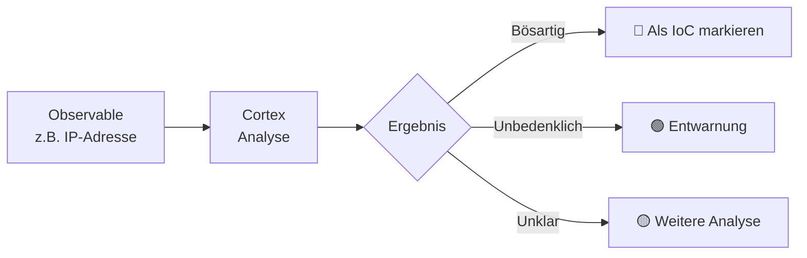
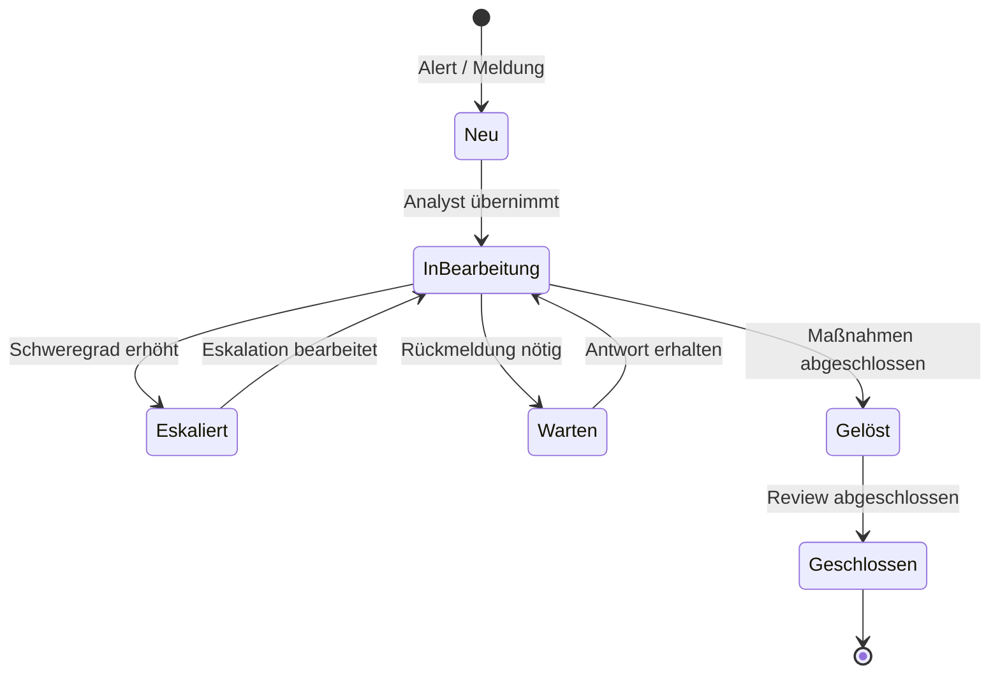

# IMS – TheHive & IRIS

## Was ist ein Incident Management System?

Ein **Incident Management System (IMS)** ist die zentrale Plattform zur Bearbeitung von Sicherheitsvorfällen. Es ermöglicht strukturierte Dokumentation, Zusammenarbeit und Nachverfolgung – vom ersten Alert bis zur vollständigen Lösung.

!!! tip "Für Entscheidungsträger"
    Das IMS ist vergleichbar mit einem **Ticketsystem für Sicherheitsvorfälle** – jeder Vorfall wird als Fall erfasst, einem Verantwortlichen zugewiesen, bearbeitet und dokumentiert. So geht nichts verloren und alle Maßnahmen sind nachvollziehbar.

---

## TheHive & IRIS im Überblick

Wir setzen auf **TheHive** und/oder **IRIS** als Incident Management Plattform:

### TheHive

| Eigenschaft | Details |
|---|---|
| **Typ** | Security Incident Response Platform |
| **Lizenz** | Open Source (AGPL) |
| **Stärken** | Case Management, Observables, Task-Tracking, Cortex-Integration |
| **Einsatz** | Kollaborative Vorfallbearbeitung im Team |

### IRIS (Incident Response Investigation System)

| Eigenschaft | Details |
|---|---|
| **Typ** | Incident Response Plattform |
| **Lizenz** | Open Source |
| **Stärken** | Forensische Untersuchungen, Timeline-Analyse, Evidence Management |
| **Einsatz** | Detaillierte Incident Investigation |

---

## Kernfunktionen

### 1. Case Management

Jeder Sicherheitsvorfall wird als **Case** erfasst mit:

- **Titel & Beschreibung** des Vorfalls
- **Schweregrad** (Low / Medium / High / Critical)
- **TLP** (Traffic Light Protocol) für Informationsklassifizierung
- **Zuweisungen** an verantwortliche Analysten
- **Tasks** – Aufgaben die abgearbeitet werden müssen

### 2. Observables & IoC-Tracking

Verdächtige Indikatoren werden als **Observables** erfasst und verfolgt:

- IP-Adressen
- Domains & URLs
- Datei-Hashes (MD5, SHA256)
- E-Mail-Adressen
- Registry Keys

### 3. Kollaboration

- Mehrere Analysten arbeiten gleichzeitig an Cases
- Kommentare und Notizen für jeden Case
- Vollständiger **Audit-Trail** aller Aktionen

### 4. Reporting

- Automatische Generierung von Incident Reports
- Export für Compliance-Nachweise
- Statistiken über Vorfalltypen und Bearbeitungszeiten

---

## Incident-Lebenszyklus

---

## Integration mit anderen Systemen

| System | Richtung | Integration |
|---|---|---|
| **Shuffle (SOAR)** | → IMS | Automatische Case-Erstellung aus validierten Alerts |
| **Cortex** | ↔ IMS | Observable-Analyse direkt aus dem Case heraus |
| **MISP (TIPL)** | → IMS | IoCs aus Threat Intelligence als Observables importieren |
| **Wazuh (SIEM)** | → IMS | Über Shuffle: Alerts werden zu Cases |

---

## Was Sie als Kunde sehen

- **Case-Dashboard** – Übersicht aller aktuellen und vergangenen Vorfälle
- **Incident Reports** – Detaillierte Berichte zu jedem abgeschlossenen Vorfall
- **Metriken** – Mean Time to Detect (MTTD), Mean Time to Respond (MTTR)
- **Benachrichtigungen** – Bei neuen oder eskalierten Vorfällen

---

## Weiterführende Links

- [Cortex](cortex.md) – Automatische Analyse von Observables
- [SOAR – Shuffle](soar-shuffle.md) – Automatisierte Case-Erstellung
- [Systemarchitektur](../architektur.md) – Gesamtübersicht der Integration
