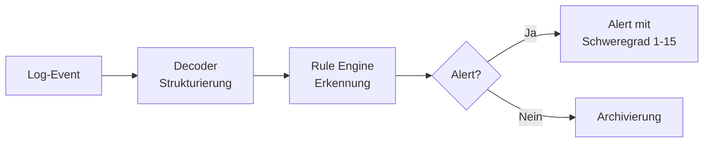
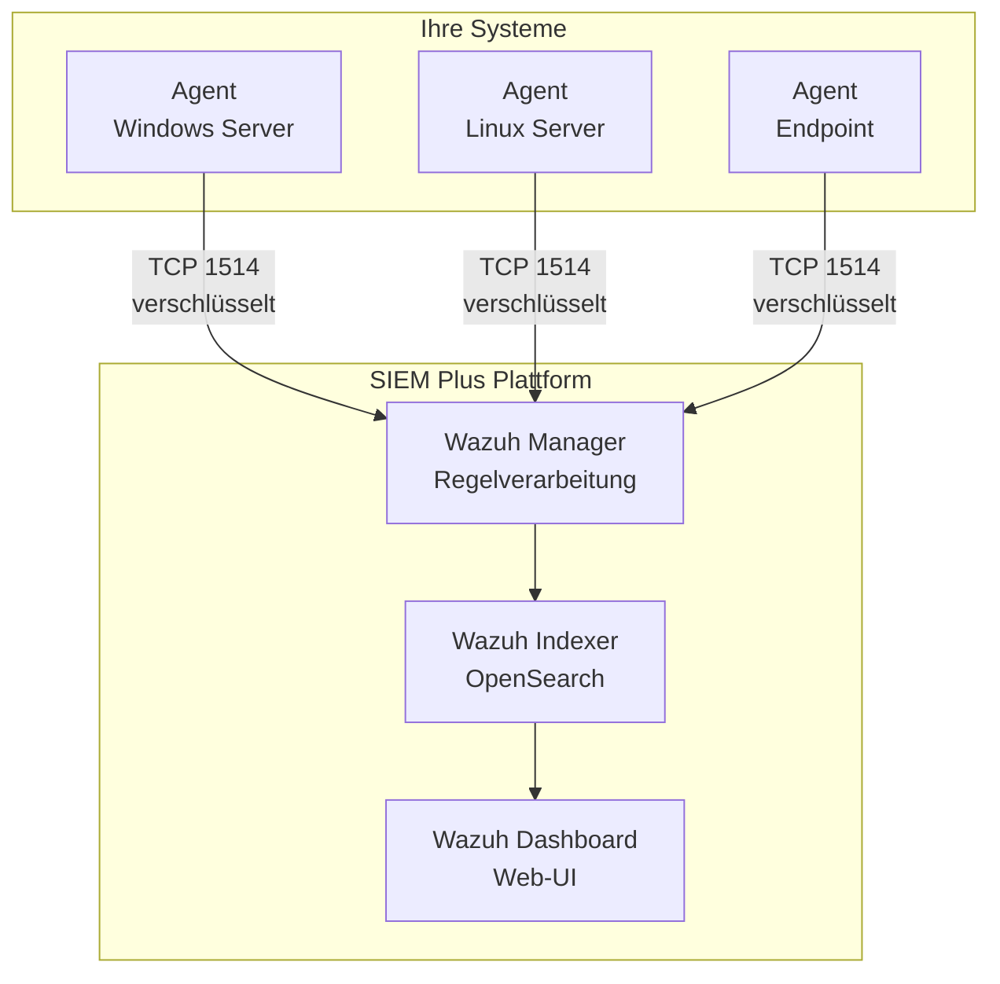

# SIEM – Wazuh

## Was ist ein SIEM?

**SIEM** steht für **Security Information and Event Management**. Ein SIEM-System sammelt sicherheitsrelevante Daten aus Ihrer gesamten IT-Infrastruktur, korreliert diese und erkennt Bedrohungen in Echtzeit.

!!! tip "Für Entscheidungsträger"
    Stellen Sie sich Wazuh als die **zentrale Alarmanlage** Ihres Unternehmens vor – es überwacht alle digitalen „Türen und Fenster" und schlägt Alarm, wenn etwas Ungewöhnliches passiert.

---

## Warum Wazuh?

Wazuh ist eine **Open-Source SIEM-Plattform**, die in unserem Managed SIEM Plus Service als Kernsystem eingesetzt wird:

| Eigenschaft | Vorteil |
|---|---|
| Open Source | Keine Lizenzkosten, volle Transparenz |
| Skalierbar | Wächst mit Ihrer Infrastruktur mit |
| Regelbasiert | Tausende vordefinierte Erkennungsregeln |
| Compliance-fähig | Unterstützt PCI-DSS, GDPR, HIPAA, NIST |
| Agent-basiert | Detaillierte Sicht auf jedes überwachte System |

---

## Kernfunktionen

### 1. Log-Sammlung & -Analyse

Wazuh sammelt Logs von allen angebundenen Systemen über **Agents**:

- Windows Event Logs
- Linux Syslog & Audit Logs
- Firewall & IDS/IPS Logs
- Application Logs
- Cloud-Service Logs (AWS, Azure, GCP)

### 2. Bedrohungserkennung

- **Decoder** parsen und strukturieren rohe Log-Daten
- Die **Rule Engine** prüft Events gegen Erkennungsregeln
- Bei Treffern werden **Alerts** mit Schweregrad (Level 1–15) erzeugt

### 3. File Integrity Monitoring (FIM)

Überwacht kritische Dateien und Verzeichnisse auf Änderungen:

- Konfigurationsdateien
- Systembinaries
- Sensible Datenverzeichnisse

### 4. Vulnerability Detection

Automatisches Scannen installierter Software gegen bekannte Schwachstellen (CVEs).

### 5. Compliance Monitoring

Kontinuierliche Prüfung der Systemkonfiguration gegen Standards:

- **PCI-DSS** – Kreditkartenindustrie
- **GDPR/DSGVO** – Datenschutz
- **NIST 800-53** – US-Sicherheitsstandard
- **CIS Benchmarks** – Härtungsrichtlinien

---

## Architektur-Komponenten

| Komponente | Funktion |
|---|---|
| **Wazuh Agent** | Läuft auf überwachten Systemen, sammelt und sendet Daten |
| **Wazuh Manager** | Empfängt Daten, wendet Regeln an, erzeugt Alerts |
| **Wazuh Indexer** | Speichert Events (basiert auf OpenSearch) |
| **Wazuh Dashboard** | Web-Oberfläche für Analyse und Reporting |

---

## Integration mit anderen Systemen

Wazuh ist das **Herzstück** unseres Blue Team Stacks und liefert Daten an alle anderen Komponenten:

- **→ Shuffle (SOAR):** Alerts werden per Webhook an Shuffle weitergeleitet für automatisierte Reaktion
- **← MISP (TIPL):** Threat Intelligence Feeds werden in Wazuh-Regeln integriert
- **→ TheHive/IRIS (IMS):** Über Shuffle werden validierte Alerts als Cases erstellt

---

## Was Sie als Kunde sehen

Im Rahmen des Managed SIEM Plus Service erhalten Sie:

- **Wazuh Dashboard** – Zugang zur Web-Oberfläche mit Ihren Daten
- **Custom Dashboards** – Auf Ihre Bedürfnisse zugeschnittene Übersichten
- **Regelmäßige Reports** – Zusammenfassungen der Sicherheitslage
- **Alert-Benachrichtigungen** – Bei kritischen Vorfällen werden Sie informiert

---

## Weiterführende Links

- [Systemarchitektur](../architektur.md) – Wie Wazuh mit den anderen Systemen zusammenarbeitet
- [SOAR – Shuffle](soar-shuffle.md) – Automatisierte Reaktion auf Wazuh-Alerts
- [SIEM Plus Service](../service/siem-plus.md) – Unser Managed Service im Detail
