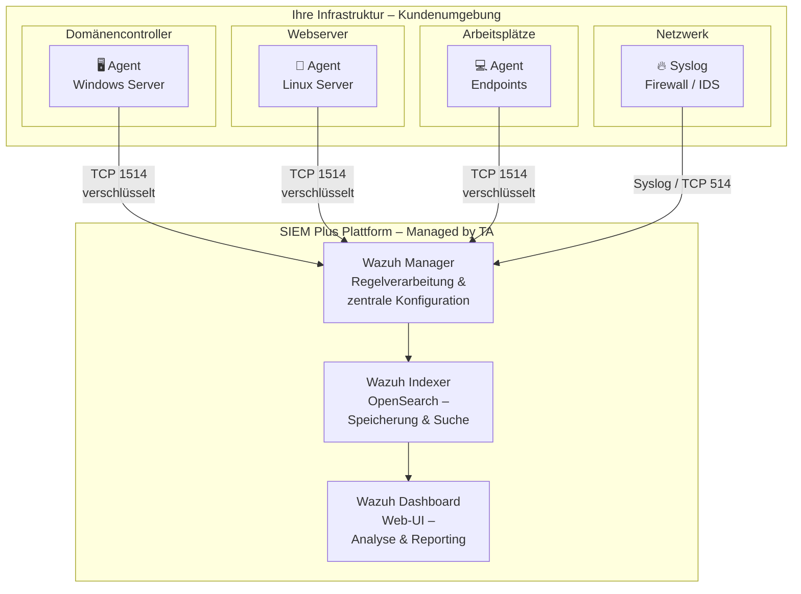
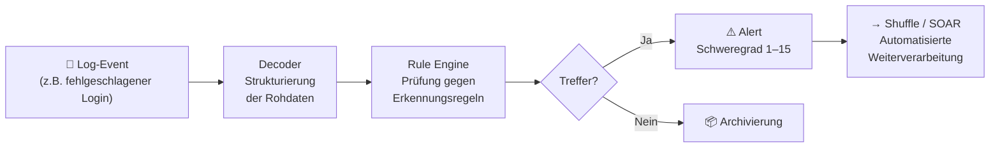
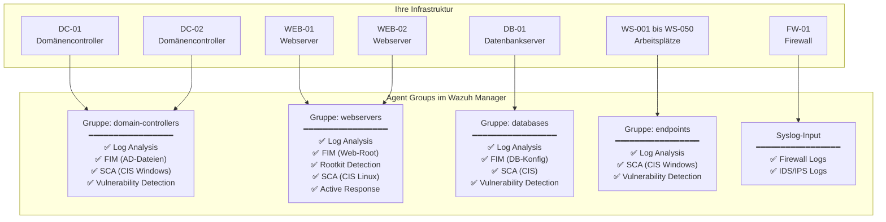
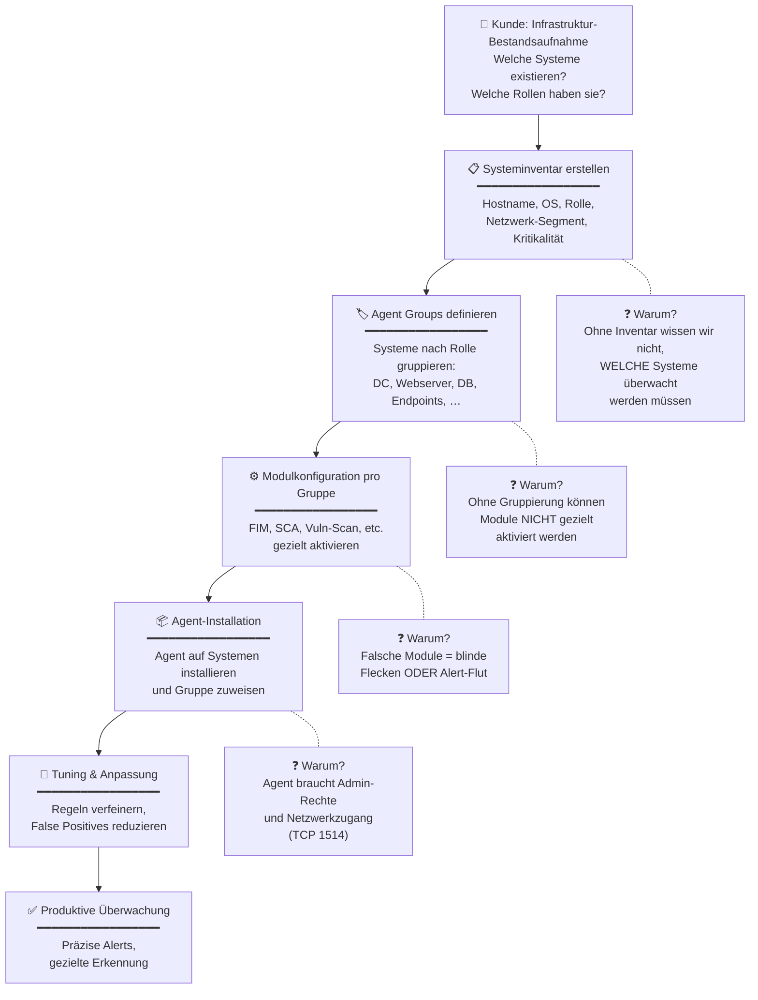
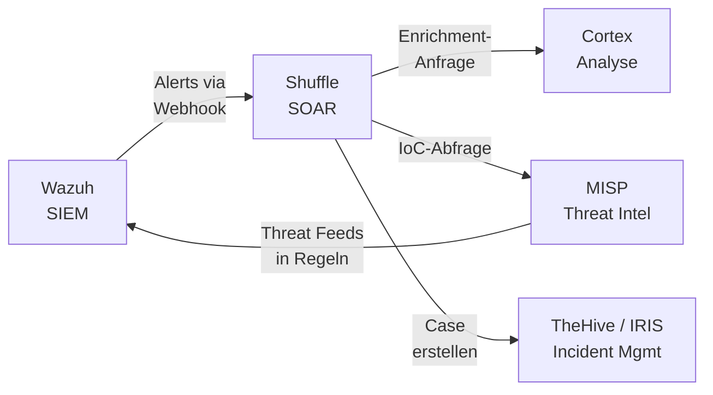

# SIEM – Wazuh

## Was ist ein SIEM?

**SIEM** steht für **Security Information and Event Management**. Ein SIEM-System sammelt sicherheitsrelevante Daten aus Ihrer gesamten IT-Infrastruktur, korreliert diese und erkennt Bedrohungen in Echtzeit.

!!! tip "Für Entscheidungsträger"
    Stellen Sie sich Wazuh als die **zentrale Alarmanlage** Ihres Unternehmens vor – es überwacht alle digitalen „Türen und Fenster" und schlägt Alarm, wenn etwas Ungewöhnliches passiert. Aber anders als eine einfache Alarmanlage kann Wazuh **gezielt konfiguriert** werden: Jeder Bereich Ihres Unternehmens bekommt genau die Überwachung, die er braucht.

---

## Warum Wazuh?

Wazuh ist eine **Open-Source SIEM-Plattform**, die in unserem Managed SIEM Plus Service als Kernsystem eingesetzt wird:

| Eigenschaft | Vorteil |
|---|---|
| Open Source | Keine Lizenzkosten, volle Transparenz |
| Skalierbar | Wächst mit Ihrer Infrastruktur mit |
| Regelbasiert | Tausende vordefinierte Erkennungsregeln |
| Modular | Funktionen werden gezielt pro Systemgruppe aktiviert |
| Compliance-fähig | Unterstützt PCI-DSS, DSGVO, HIPAA, NIST, ISO 27001 |
| Agent-basiert | Detaillierte Sicht auf jedes überwachte System |

---

## Architektur im Überblick

Wazuh besteht aus vier Kernkomponenten, die als Managed Service von uns betrieben werden – bei Ihnen wird lediglich der **Agent** installiert:

```mermaid
graph TB
    subgraph "Ihre Infrastruktur – Kundenumgebung"
        subgraph "Domänencontroller"
            A1["🖥️ Agent<br/>Windows Server"]
        end
        subgraph "Webserver"
            A2["🐧 Agent<br/>Linux Server"]
        end
        subgraph "Arbeitsplätze"
            A3["💻 Agent<br/>Endpoints"]
        end
        subgraph "Netzwerk"
            FW["🔥 Syslog<br/>Firewall / IDS"]
        end
    end

    subgraph "SIEM Plus Plattform – Managed by TA"
        M["Wazuh Manager<br/>Regelverarbeitung &<br/>zentrale Konfiguration"]
        I["Wazuh Indexer<br/>OpenSearch –<br/>Speicherung & Suche"]
        D["Wazuh Dashboard<br/>Web-UI –<br/>Analyse & Reporting"]
    end

    A1 & A2 & A3 -->|"TCP 1514<br/>verschlüsselt"| M
    FW -->|"Syslog / TCP 514"| M
    M --> I
    I --> D
```

| Komponente | Standort | Funktion |
|---|---|---|
| **Wazuh Agent** | Ihre Systeme | Sammelt Logs, überwacht Dateien, prüft Konfigurationen |
| **Wazuh Manager** | Managed Plattform | Empfängt Daten, wendet Regeln an, verwaltet Agent-Konfiguration |
| **Wazuh Indexer** | Managed Plattform | Speichert und indiziert alle Events (OpenSearch) |
| **Wazuh Dashboard** | Managed Plattform | Web-Oberfläche für Analyse, Suche und Reporting |

---

## Module & Funktionen

Wazuh ist **modular** aufgebaut. Nicht jedes System braucht jedes Modul – die Module werden **gezielt pro Agent-Gruppe** aktiviert. So entsteht kein unnötiger Overhead und die Erkennung ist präzise auf die jeweilige Systemrolle zugeschnitten.

### Modul-Übersicht

| Modul | Was es tut | Typischer Einsatz |
|---|---|---|
| **Log Data Analysis** | Sammelt und analysiert System- und Anwendungslogs | Alle Systeme |
| **File Integrity Monitoring (FIM)** | Erkennt Änderungen an kritischen Dateien | Server, Domänencontroller |
| **Rootkit Detection** | Sucht nach versteckten Prozessen und Dateien | Linux-Server |
| **Security Configuration Assessment (SCA)** | Prüft Konfigurationen gegen Härtungsstandards (CIS) | Server, Endpoints |
| **Vulnerability Detection** | Scannt installierte Software gegen bekannte CVEs | Alle Systeme |
| **Active Response** | Automatische Reaktion auf Bedrohungen (z.B. IP-Block) | Exponierte Systeme |
| **Compliance (PCI-DSS, DSGVO, NIST)** | Kontinuierliche Compliance-Prüfung | Systeme im regulierten Bereich |
| **Syslog Collection** | Empfängt Logs von Netzwerkgeräten (Firewalls, Switches) | Wazuh Manager (agentless) |

### Bedrohungserkennung im Detail

```mermaid
graph LR
    L["📄 Log-Event<br/>(z.B. fehlgeschlagener Login)"] --> D["Decoder<br/>Strukturierung<br/>der Rohdaten"]
    D --> R["Rule Engine<br/>Prüfung gegen<br/>Erkennungsregeln"]
    R --> A{"Treffer?"}
    A -->|"Ja"| AL["⚠️ Alert<br/>Schweregrad 1–15"]
    A -->|"Nein"| AR["📦 Archivierung"]
    AL --> S["→ Shuffle / SOAR<br/>Automatisierte<br/>Weiterverarbeitung"]
```

- **Decoder** parsen und strukturieren rohe Log-Daten in auswertbare Felder
- Die **Rule Engine** prüft Events gegen tausende Erkennungsregeln
- Bei Treffern werden **Alerts** mit Schweregrad (Level 1–15) erzeugt
- Ab einem definierten Schwellwert werden Alerts automatisch an **Shuffle** zur Weiterverarbeitung übergeben

---

## Agent Groups – Das zentrale Konfigurationskonzept

!!! warning "Wichtig für Kunden"
    Die korrekte Zuordnung Ihrer Systeme in **Agent Groups** ist die wichtigste Voraussetzung für eine wirksame Überwachung. Ohne diese Zuordnung können wir die richtigen Module nicht aktivieren.

### Was sind Agent Groups?

Agent Groups sind **logische Gruppen**, in die Ihre Systeme eingeteilt werden. Jede Gruppe erhält eine **eigene Konfiguration** – also ein eigenes Set an aktivierten Modulen, Überwachungsregeln und Schwellwerten.

```mermaid
graph TB
    subgraph "Ihre Infrastruktur"
        DC1["DC-01<br/>Domänencontroller"]
        DC2["DC-02<br/>Domänencontroller"]
        WEB1["WEB-01<br/>Webserver"]
        WEB2["WEB-02<br/>Webserver"]
        DB1["DB-01<br/>Datenbankserver"]
        WS1["WS-001 bis WS-050<br/>Arbeitsplätze"]
        FW1["FW-01<br/>Firewall"]
    end

    subgraph "Agent Groups im Wazuh Manager"
        G1["Gruppe: domain-controllers<br/>━━━━━━━━━━━━━━━━━<br/>✅ Log Analysis<br/>✅ FIM (AD-Dateien)<br/>✅ SCA (CIS Windows)<br/>✅ Vulnerability Detection"]
        G2["Gruppe: webservers<br/>━━━━━━━━━━━━━━━━━<br/>✅ Log Analysis<br/>✅ FIM (Web-Root)<br/>✅ Rootkit Detection<br/>✅ SCA (CIS Linux)<br/>✅ Active Response"]
        G3["Gruppe: databases<br/>━━━━━━━━━━━━━━━━━<br/>✅ Log Analysis<br/>✅ FIM (DB-Konfig)<br/>✅ SCA (CIS)<br/>✅ Vulnerability Detection"]
        G4["Gruppe: endpoints<br/>━━━━━━━━━━━━━━━━━<br/>✅ Log Analysis<br/>✅ SCA (CIS Windows)<br/>✅ Vulnerability Detection"]
        G5["Syslog-Input<br/>━━━━━━━━━━━━━━━━━<br/>✅ Firewall Logs<br/>✅ IDS/IPS Logs"]
    end

    DC1 & DC2 --> G1
    WEB1 & WEB2 --> G2
    DB1 --> G3
    WS1 --> G4
    FW1 --> G5
```

### Warum ist die richtige Zuordnung so wichtig?

| Szenario | Problem | Konsequenz |
|---|---|---|
| Webserver in der Gruppe „endpoints" | Kein FIM für Web-Root, kein Rootkit-Scan | Web-Shell-Angriffe bleiben **unerkannt** |
| Domänencontroller ohne SCA | Keine Härtungsprüfung gegen CIS-Benchmarks | Fehlkonfigurationen am AD bleiben **unsichtbar** |
| Datenbankserver ohne FIM | Keine Überwachung der DB-Konfigurationsdateien | Manipulation an der DB-Konfiguration wird **nicht bemerkt** |
| Alle Systeme in einer Gruppe | Identische Konfiguration für alles | Zu viele irrelevante Alerts (**Alert Fatigue**) oder fehlende Abdeckung |

!!! success "Kernprinzip"
    **Gleiche Rolle → Gleiche Gruppe → Gleiche Überwachung.** Nur wenn wir wissen, welche Funktion ein System in Ihrer Infrastruktur hat, können wir die passenden Module aktivieren und präzise Erkennungsregeln zuweisen.

---

## Prozessablauf: Von der Infrastruktur zur gezielten Überwachung

Der folgende Prozess zeigt, wie wir gemeinsam von Ihrer Systemlandschaft zu einer optimal konfigurierten Überwachung kommen – und warum jede einzelne Voraussetzung nötig ist.

```mermaid
graph TB
    START["🏢 Kunde: Infrastruktur-Bestandsaufnahme<br/>Welche Systeme existieren?<br/>Welche Rollen haben sie?"]

    INV["📋 Systeminventar erstellen<br/>━━━━━━━━━━━━━━━━━<br/>Hostname, OS, Rolle,<br/>Netzwerk-Segment, Kritikalität"]

    GROUP["🏷️ Agent Groups definieren<br/>━━━━━━━━━━━━━━━━━<br/>Systeme nach Rolle gruppieren:<br/>DC, Webserver, DB, Endpoints, …"]

    CONFIG["⚙️ Modulkonfiguration pro Gruppe<br/>━━━━━━━━━━━━━━━━━<br/>FIM, SCA, Vuln-Scan, etc.<br/>gezielt aktivieren"]

    DEPLOY["📦 Agent-Installation<br/>━━━━━━━━━━━━━━━━━<br/>Agent auf Systemen installieren<br/>und Gruppe zuweisen"]

    TUNE["🔧 Tuning & Anpassung<br/>━━━━━━━━━━━━━━━━━<br/>Regeln verfeinern,<br/>False Positives reduzieren"]

    LIVE["✅ Produktive Überwachung<br/>━━━━━━━━━━━━━━━━━<br/>Präzise Alerts,<br/>gezielte Erkennung"]

    START --> INV
    INV --> GROUP
    GROUP --> CONFIG
    CONFIG --> DEPLOY
    DEPLOY --> TUNE
    TUNE --> LIVE

    INV -.- N1["❓ Warum?<br/>Ohne Inventar wissen wir nicht,<br/>WELCHE Systeme überwacht<br/>werden müssen"]
    GROUP -.- N2["❓ Warum?<br/>Ohne Gruppierung können<br/>Module NICHT gezielt<br/>aktiviert werden"]
    CONFIG -.- N3["❓ Warum?<br/>Falsche Module = blinde<br/>Flecken ODER Alert-Flut"]
    DEPLOY -.- N4["❓ Warum?<br/>Agent braucht Admin-Rechte<br/>und Netzwerkzugang<br/>(TCP 1514)"]
```

### Was wir vom Kunden brauchen – und warum

| Voraussetzung | Was genau? | Warum ist das nötig? |
|---|---|---|
| **Systemverzeichnis** | Liste aller zu überwachenden Systeme mit Hostname, OS und Rolle | Ohne diese Information können wir weder Agent Groups bilden noch die richtigen Module auswählen |
| **Rollen-Zuordnung** | Welche Funktion hat jedes System? (DC, Webserver, DB, Endpoint, …) | Die Rolle bestimmt, welche Module aktiviert werden – ein Webserver braucht andere Überwachung als ein Arbeitsplatz |
| **Netzwerk-Segmentierung** | In welchen Netzsegmenten stehen die Systeme? | Ermöglicht die Erstellung von Regeln, die abnormalen Netzwerkverkehr zwischen Segmenten erkennen |
| **Netzwerk-Freigabe TCP 1514** | Ausgehende Verbindung von allen Agents zur SIEM-Plattform | Der Agent muss seine gesammelten Daten verschlüsselt an den Wazuh Manager übertragen können |
| **Admin-Zugang** | Lokaler Admin / Root auf den zu überwachenden Systemen | Der Agent muss als Dienst installiert werden und braucht Leserechte auf Logs und Systemdateien |
| **Technischer Ansprechpartner** | Person mit Infrastruktur-Kenntnissen auf Kundenseite | Für Rückfragen zur Systemlandschaft und bei der Gruppenbildung unverzichtbar |
| **Kritikalitätsbewertung** | Welche Systeme sind geschäftskritisch? | Bestimmt Alert-Prioritäten und Eskalationswege – ein Alert auf dem DC hat andere Dringlichkeit als auf einem Test-System |

---

## Praxisbeispiel: Agent Groups in Aktion

Nehmen wir ein mittelständisches Unternehmen mit folgender Infrastruktur:

=== "Infrastruktur"

    | System | Anzahl | Rolle |
    |---|---|---|
    | Windows Server 2022 | 2 | Active Directory Domänencontroller |
    | Ubuntu 22.04 | 3 | Webserver (Apache) |
    | Ubuntu 22.04 | 1 | Datenbankserver (PostgreSQL) |
    | Windows 11 | 50 | Arbeitsplätze |
    | FortiGate 60F | 1 | Firewall |

=== "Agent Groups"

    | Gruppe | Systeme | Aktivierte Module |
    |---|---|---|
    | `domain-controllers` | DC-01, DC-02 | Log Analysis, FIM (NTDS.dit, GPO, SYSVOL), SCA (CIS Windows Server), Vulnerability Detection |
    | `webservers-linux` | WEB-01, WEB-02, WEB-03 | Log Analysis (Apache Access/Error), FIM (/var/www, /etc/apache2), Rootkit Detection, SCA (CIS Ubuntu), Active Response |
    | `databases` | DB-01 | Log Analysis (PostgreSQL), FIM (pg_hba.conf, postgresql.conf), SCA (CIS PostgreSQL), Vulnerability Detection |
    | `endpoints-win` | WS-001 bis WS-050 | Log Analysis, SCA (CIS Windows 11), Vulnerability Detection |
    | *(Syslog-Input)* | FortiGate | Firewall-Logs via Syslog an Wazuh Manager |

=== "Ergebnis"

    - **Domänencontroller** werden auf AD-spezifische Angriffe überwacht (Golden Ticket, DCSync, GPO-Manipulation)
    - **Webserver** werden auf Web-Shells, Rootkits und Config-Änderungen geprüft
    - **Datenbankserver** wird auf unautorisierte Konfigurationsänderungen und bekannte CVEs überwacht
    - **Arbeitsplätze** werden auf Malware-Indikatoren, Software-Schwachstellen und Härtungslücken geprüft
    - **Firewall** liefert Netzwerk-Events für Korrelation mit Host-basierten Alerts

---

## Integration mit anderen Systemen

Wazuh ist das **Herzstück** unseres Blue Team Stacks und liefert Daten an alle anderen Komponenten:

```mermaid
graph LR
    W["Wazuh<br/>SIEM"] -->|"Alerts via<br/>Webhook"| SH["Shuffle<br/>SOAR"]
    SH -->|"Enrichment-<br/>Anfrage"| CO["Cortex<br/>Analyse"]
    SH -->|"IoC-Abfrage"| MI["MISP<br/>Threat Intel"]
    MI -->|"Threat Feeds<br/>in Regeln"| W
    SH -->|"Case<br/>erstellen"| TH["TheHive / IRIS<br/>Incident Mgmt"]
```

| Integration | Richtung | Beschreibung |
|---|---|---|
| **→ Shuffle (SOAR)** | Wazuh → Shuffle | Alerts werden per Webhook weitergeleitet für automatisierte Triage und Reaktion |
| **← MISP (TIPL)** | MISP → Wazuh | Threat Intelligence Feeds (IoCs) werden in Wazuh-Regeln integriert |
| **→ TheHive/IRIS** | Shuffle → TheHive | Validierte Alerts werden als Cases mit Kontext erstellt |
| **↔ Cortex** | Shuffle ↔ Cortex | Anreicherung von Observables (IP, Hash, Domain) mit Threat-Daten |

---

## Was Sie als Kunde sehen

Im Rahmen des Managed SIEM Plus Service erhalten Sie:

- **Wazuh Dashboard** – Zugang zur Web-Oberfläche mit Ihren Daten
- **Custom Dashboards** – Auf Ihre Systemlandschaft zugeschnittene Übersichten (z.B. AD-Health, Web-Security, Compliance-Status)
- **Agent-Übersicht** – Status aller Agents und deren Gruppenzugehörigkeit
- **Regelmäßige Reports** – Zusammenfassungen der Sicherheitslage inkl. Compliance-Stand
- **Alert-Benachrichtigungen** – Bei kritischen Vorfällen werden Sie über den vereinbarten Kanal informiert

---

## Weiterführende Links

- [Systemarchitektur](../architektur.md) – Wie Wazuh mit den anderen Systemen zusammenarbeitet
- [SOAR – Shuffle](soar-shuffle.md) – Automatisierte Reaktion auf Wazuh-Alerts
- [Onboarding](../service/onboarding.md) – Der Weg von der Bestandsaufnahme zur produktiven Überwachung
- [SIEM Plus Service](../service/siem-plus.md) – Unser Managed Service im Detail
