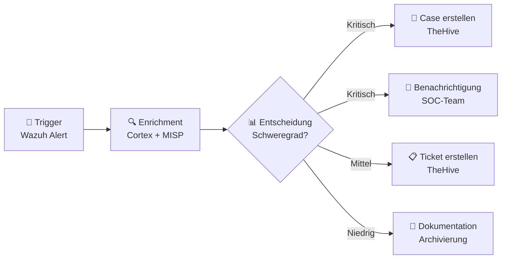
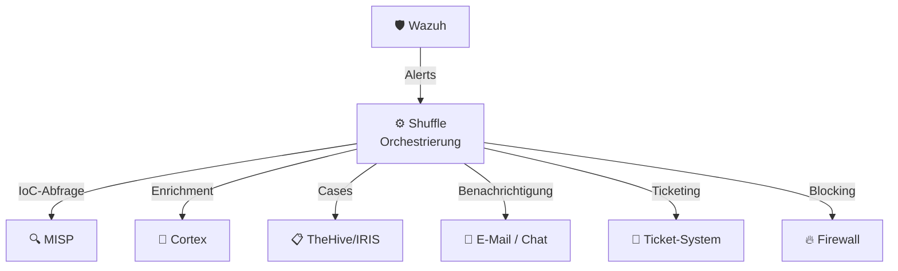

# SOAR – Shuffle

## Was ist SOAR?

**SOAR** steht für **Security Orchestration, Automation and Response**. Ein SOAR-System verbindet verschiedene Sicherheitstools miteinander und automatisiert wiederkehrende Prozesse – vom Alert bis zur Reaktion.

!!! tip "Für Entscheidungsträger"
    Shuffle ist der **Dirigent unseres Sicherheitsorchesters** – es koordiniert alle Systeme, sorgt dafür, dass Informationen automatisch fließen, und reagiert auf Bedrohungen innerhalb von Sekunden statt Stunden.

---

## Shuffle im Überblick

**Shuffle** ist eine Open-Source SOAR-Plattform, die speziell für Security Operations entwickelt wurde:

| Eigenschaft | Details |
|---|---|
| **Typ** | Security Orchestration, Automation & Response |
| **Lizenz** | Open Source (AGPL) |
| **Stärken** | Visueller Workflow-Editor, breite API-Integration, No-Code-Ansatz |
| **Einsatz** | Automatisierung von Sicherheitsprozessen |

---

## Kernfunktionen

### 1. Workflow-Automatisierung (Playbooks)

Shuffle automatisiert Sicherheitsprozesse durch **visuelle Workflows**:

Typische automatisierte Workflows:

| Workflow | Trigger | Aktionen |
|---|---|---|
| **Alert Triage** | Neuer Wazuh-Alert | IoC-Check in MISP, Enrichment via Cortex, Case erstellen |
| **Phishing Response** | Phishing-Meldung | URL-Analyse, Sender-Check, Mailbox-Scan, Blockierung |
| **Malware Detection** | Datei-Hash Alert | Hash-Check in MISP, Sandbox-Analyse, Endpoint-Isolation |
| **Brute Force Response** | Login-Anomalie | IP-Reputation prüfen, Account sperren, Case erstellen |

### 2. Orchestrierung

Shuffle verbindet alle Systeme über **APIs** und fungiert als zentrale Integrationsplattform:

### 3. Response-Aktionen

Automatisierte Reaktionen auf erkannte Bedrohungen:

- **Blocking** – IP-Adressen auf Firewalls sperren
- **Isolation** – Kompromittierte Endpoints isolieren
- **Account-Sperrung** – Betroffene Benutzerkonten deaktivieren
- **Benachrichtigung** – Stakeholder per E-Mail, Slack oder Teams informieren
- **Dokumentation** – Automatische Erstellung von Incident-Reports

### 4. Metriken & Reporting

- **Mean Time to Respond (MTTR)** – Durchschnittliche Reaktionszeit
- **Automatisierungsgrad** – Anteil automatisch bearbeiteter Alerts
- **Workflow-Statistiken** – Ausführungshäufigkeit und Erfolgsquoten

---

## Vorteile der Automatisierung

| Ohne SOAR | Mit Shuffle |
|---|---|
| Manuelle Prüfung jedes Alerts | Automatische Triage und Enrichment |
| Minuten bis Stunden Reaktionszeit | Sekunden Reaktionszeit |
| Analystzeit für Routine-Aufgaben | Analysten fokussieren auf komplexe Fälle |
| Inkonsistente Prozesse | Standardisierte, wiederholbare Playbooks |
| Fragmentierte Tool-Landschaft | Zentrale Orchestrierung aller Tools |

---

## Integration mit anderen Systemen

| System | Richtung | Integration |
|---|---|---|
| **Wazuh (SIEM)** | SIEM → Shuffle | Alerts per Webhook empfangen |
| **MISP (TIPL)** | Shuffle ↔ MISP | IoC-Abfragen und Feed-Updates |
| **Cortex** | Shuffle → Cortex | Enrichment-Anfragen für Observables |
| **TheHive/IRIS (IMS)** | Shuffle → IMS | Automatische Case-Erstellung |

---

## Was Sie als Kunde davon haben

- **Schnellere Reaktion** – Bedrohungen werden in Sekunden statt Stunden bearbeitet
- **Weniger Fehlalarme** – Automatische Vorab-Analyse reduziert False Positives
- **Transparenz** – Alle automatisierten Aktionen sind nachvollziehbar dokumentiert
- **Konsistenz** – Jeder Alert wird nach dem gleichen Prozess bearbeitet

---

## Weiterführende Links

- [SIEM – Wazuh](siem-wazuh.md) – Die Alert-Quelle für Shuffle
- [Cortex](cortex.md) – Enrichment-Engine für Shuffle-Workflows
- [IMS – TheHive/IRIS](ims-thehive-iris.md) – Ziel der automatisierten Case-Erstellung
