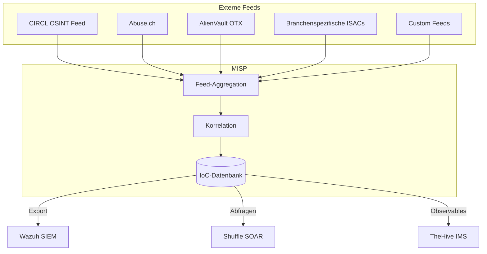

# TIPL – MISP

## Was ist eine Threat Intelligence Platform?

Eine **Threat Intelligence Platform (TIPL)** sammelt, verarbeitet und teilt Informationen über aktuelle Cyberbedrohungen – sogenannte **Indicators of Compromise (IoCs)**. Diese Informationen helfen, Angriffe schneller zu erkennen und darauf zu reagieren.

!!! tip "Für Entscheidungsträger"
    MISP ist wie ein **Nachrichtendienst für Cyberbedrohungen** – es sammelt weltweit aktuelle Informationen über bekannte Angriffsmuster, bösartige IP-Adressen und Schadsoftware und macht diese Informationen für unsere Erkennungssysteme nutzbar.

---

## MISP im Überblick

**MISP** (Malware Information Sharing Platform & Threat Sharing) ist die führende Open-Source-Plattform für Threat Intelligence:

| Eigenschaft | Details |
|---|---|
| **Typ** | Threat Intelligence Platform |
| **Lizenz** | Open Source (AGPL) |
| **Entwicklung** | CIRCL (Computer Incident Response Center Luxembourg) |
| **Stärken** | IoC-Management, Community-Sharing, Feed-Aggregation |
| **Standard** | MISP-Format ist De-facto-Standard für Threat Intelligence |

---

## Kernfunktionen

### 1. IoC-Management

MISP verwaltet verschiedenste Typen von Indicators of Compromise:

| IoC-Typ | Beispiel | Erkennung |
|---|---|---|
| IP-Adressen | `192.168.1.100` (C2-Server) | Netzwerk-Kommunikation |
| Domains | `evil-domain.com` | DNS-Anfragen |
| Datei-Hashes | `a1b2c3d4...` (SHA256) | Malware-Erkennung |
| URLs | `https://phishing.example/login` | Web-Traffic |
| E-Mail-Adressen | `attacker@evil.com` | Phishing-Erkennung |
| YARA-Regeln | Pattern-basierte Erkennung | Datei-Analyse |

### 2. Threat Feeds

MISP aggregiert Bedrohungsinformationen aus multiplen Quellen:

### 3. Event-basierte Organisation

Bedrohungen werden in MISP als **Events** organisiert:

- **Event** – Ein Sicherheitsvorfall oder eine Kampagne (z.B. „Emotet Kampagne Q1 2026")
- **Attribute** – Einzelne IoCs innerhalb eines Events
- **Objects** – Strukturierte Zusammenfassung mehrerer Attribute
- **Galaxies** – Kategorisierung nach Bedrohungsakteur, Malware-Familie, Angriffsmuster (MITRE ATT&CK)
- **Tags** – Flexible Kennzeichnung (TLP, Confidence Level)

### 4. Sharing & Communities

MISP ermöglicht den kontrollierten Austausch von Threat Intelligence:

- **Sharing Groups** – Definierte Empfängergruppen
- **TLP-Markierungen** – Kontrollierte Weitergabe (TLP:RED bis TLP:CLEAR)
- **Synchronisation** – Automatischer Austausch zwischen MISP-Instanzen
- **ISAC-Integration** – Branchenspezifische Sharing-Communities

---

## Integration mit anderen Systemen

| System | Integration | Nutzen |
|---|---|---|
| **Wazuh (SIEM)** | IoC-Export als CDB-Listen | Echtzeit-Erkennung bekannter Bedrohungen in Logs |
| **Shuffle (SOAR)** | REST API Abfragen | Automatische IoC-Prüfung in Playbooks |
| **TheHive/IRIS (IMS)** | Observable-Import | Anreicherung von Cases mit Threat-Kontext |
| **Cortex** | Analyzer-Integration | MISP als Datenquelle für Cortex-Analysen |

---

## Mehrwert für Ihr Unternehmen

### Proaktiver Schutz

- Bekannte Bedrohungen werden **automatisch erkannt** bevor sie Schaden anrichten
- Branchenspezifische Feeds sorgen für **relevante** Threat Intelligence
- Neue IoCs werden innerhalb von Minuten in die Erkennung integriert

### Compliance & Reporting

- Dokumentation der genutzten Threat Intelligence Quellen
- Nachvollziehbare Entscheidungsgrundlagen bei Vorfällen
- Reporting über erkannte Bedrohungen und deren Quellen

---

## Weiterführende Links

- [SIEM – Wazuh](siem-wazuh.md) – Wie MISP-IoCs in der Erkennung genutzt werden
- [SOAR – Shuffle](soar-shuffle.md) – Automatische IoC-Prüfung in Workflows
- [Glossar](../glossar.md) – Erklärung von Fachbegriffen wie IoC, TLP, ISAC
