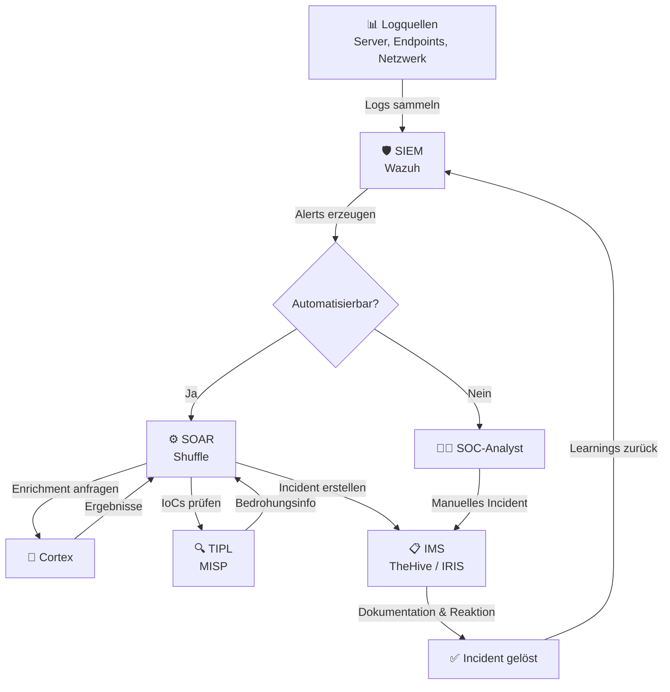

# Blue Team Operations – Überblick

## Was ist Blue Teaming?

**Blue Teaming** bezeichnet die defensive Seite der Cybersicherheit. Während „Red Teams" Angriffe simulieren, konzentriert sich das Blue Team auf die **Erkennung, Analyse und Abwehr** realer Bedrohungen.

!!! info "Kurz gesagt"
    Blue Team Operations = Ihr digitaler Sicherheitsdienst, der rund um die Uhr Ihre IT-Infrastruktur überwacht, Bedrohungen erkennt und darauf reagiert.

---

## Warum Blue Team Operations?

### Für Entscheidungsträger

Die Bedrohungslage für Unternehmen wächst stetig. Blue Team Operations bieten:

- **Frühzeitige Erkennung** von Sicherheitsvorfällen bevor Schaden entsteht
- **Compliance-Erfüllung** regulatorischer Anforderungen (NIS2, DSGVO, ISO 27001)
- **Kostenreduktion** durch Automatisierung und Managed Services
- **Risikominimierung** durch strukturierte Incident Response Prozesse
- **24/7-Überwachung** ohne eigenes SOC-Personal aufbauen zu müssen

### Für technische Teams

Blue Team Operations umfassen diese Kernprozesse:

1. **Monitoring & Detection** – Kontinuierliche Überwachung aller Logquellen
2. **Threat Intelligence** – Integration aktueller Bedrohungsinformationen
3. **Incident Response** – Strukturierte Reaktion auf erkannte Vorfälle
4. **Enrichment & Analysis** – Automatische Datenanreicherung für schnellere Bewertung
5. **Orchestration & Automation** – Automatisierte Workflows für wiederkehrende Aufgaben

---

## Der Blue Team Operations Kreislauf

---

## Unsere Systemlandschaft

Unser Blue Team Operations Stack besteht aus fünf eng integrierten Komponenten:

| Komponente | Produkt | Rolle |
|---|---|---|
| [SIEM – Wazuh](systeme/siem-wazuh.md) | Wazuh | Das Herzstück: Sammelt, korreliert und analysiert Sicherheitsereignisse |
| [IMS – TheHive / IRIS](systeme/ims-thehive-iris.md) | TheHive / IRIS | Verwaltet Sicherheitsvorfälle als strukturierte Cases |
| [TIPL – MISP](systeme/tipl-misp.md) | MISP | Stellt aktuelle Bedrohungsinformationen (IoCs) bereit |
| [SOAR – Shuffle](systeme/soar-shuffle.md) | Shuffle | Automatisiert Reaktionen und verbindet alle Systeme |
| [Cortex](systeme/cortex.md) | Cortex | Reichert Daten mit externen Quellen an |

---

## Nächste Schritte

- Lesen Sie die [Systemarchitektur](architektur.md) für eine technische Gesamtübersicht
- Erfahren Sie mehr über unseren [SIEM Plus Service](service/siem-plus.md)
- Schauen Sie ins [Glossar](glossar.md) für Fachbegriffe
