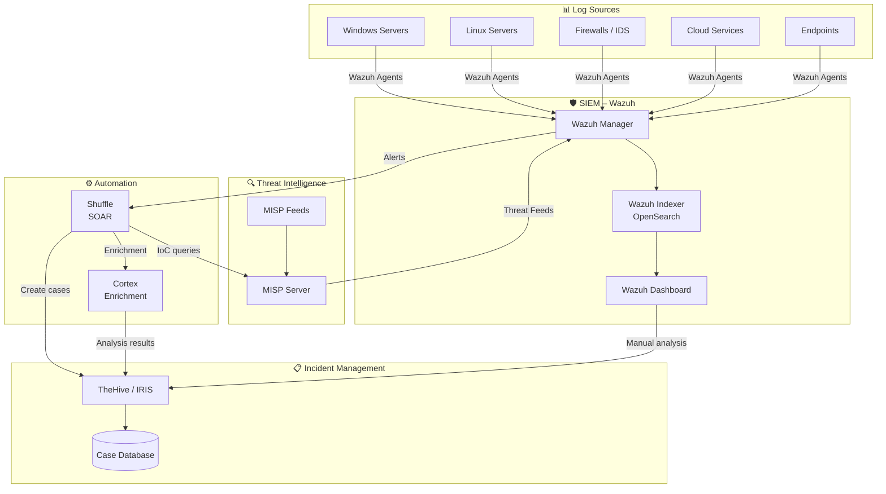
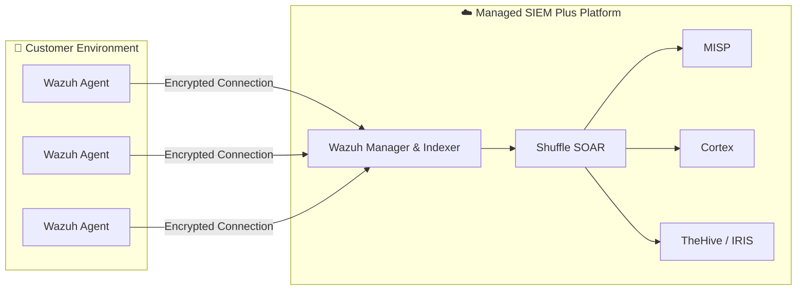

# System Architecture

## Overall Architecture

The following diagram shows how all components of our Blue Team Operations stack work together:



---

## Data Flow

### 1. Data Collection (Ingestion)

```
Log Sources → Wazuh Agents → Wazuh Manager → Wazuh Indexer (OpenSearch)
```

- **Wazuh Agents** are installed on all monitored systems
- Agents send logs encrypted to the **Wazuh Manager**
- The Manager applies **rules and decoders** and stores events in the **Indexer**

### 2. Detection

```
Wazuh Rules + MISP IoCs → Alert Generation → Prioritization
```

- Wazuh evaluates events against thousands of predefined and custom **rules**
- **MISP** provides current Indicators of Compromise (IoCs) for detection
- Alerts are prioritized by **severity** (1–15)

### 3. Orchestration

```
Alert → Shuffle Workflow → Cortex Enrichment → Decision
```

- **Shuffle** receives alerts and starts automated **playbooks**
- **Cortex** enriches suspicious indicators (IPs, hashes, domains) with external data
- Based on results: automatic action or escalation to an analyst

### 4. Incident Management

```
Validated Alert → TheHive/IRIS Case → Analysis → Response → Closure
```

- Confirmed incidents are created as **cases** in TheHive/IRIS
- Analysts document analysis, actions and results
- Completed cases feed back as **learnings** into the system

---

## Network & Communication

| From | To | Protocol | Purpose |
|---|---|---|---|
| Wazuh Agent | Wazuh Manager | TCP 1514 (encrypted) | Log transmission |
| Wazuh Manager | Wazuh Indexer | HTTPS 9200 | Event storage |
| Wazuh Manager | Shuffle | Webhook (HTTPS) | Alert forwarding |
| Shuffle | MISP | REST API (HTTPS) | IoC queries |
| Shuffle | Cortex | REST API (HTTPS) | Enrichment requests |
| Shuffle | TheHive/IRIS | REST API (HTTPS) | Case creation |
| Cortex | TheHive/IRIS | REST API (HTTPS) | Analysis results |
| MISP | Wazuh Manager | REST API (HTTPS) | Threat feed integration |

---

## Deployment Model

!!! note "Managed Service"
    As part of our **SIEM Plus** Managed Service, we operate the entire infrastructure for you. Only the **Wazuh Agents** are installed in your environment.



---

## Next Steps

Learn more about the individual systems:

- [SIEM – Wazuh](systems/siem-wazuh.md)
- [IMS – TheHive / IRIS](systems/ims-thehive-iris.md)
- [TIPL – MISP](systems/tipl-misp.md)
- [SOAR – Shuffle](systems/soar-shuffle.md)
- [Cortex](systems/cortex.md)
