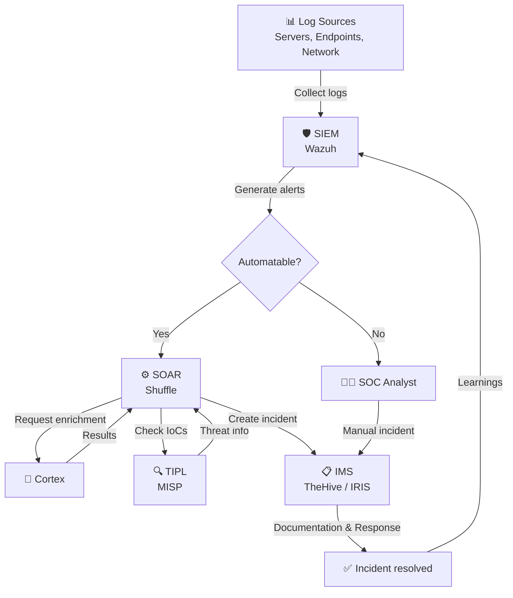

# Blue Team Operations – Overview

## What is Blue Teaming?

**Blue Teaming** refers to the defensive side of cybersecurity. While "Red Teams" simulate attacks, the Blue Team focuses on **detecting, analyzing and defending** against real threats.

!!! info "In a Nutshell"
    Blue Team Operations = Your digital security service that monitors your IT infrastructure around the clock, detects threats and responds to them.

---

## Why Blue Team Operations?

### For Decision Makers

The threat landscape for organizations is constantly growing. Blue Team Operations provide:

- **Early detection** of security incidents before damage occurs
- **Compliance fulfillment** with regulatory requirements (NIS2, GDPR, ISO 27001)
- **Cost reduction** through automation and managed services
- **Risk minimization** through structured incident response processes
- **24/7 monitoring** without the need to build your own SOC team

### For Technical Teams

Blue Team Operations comprise these core processes:

1. **Monitoring & Detection** – Continuous monitoring of all log sources
2. **Threat Intelligence** – Integration of current threat information
3. **Incident Response** – Structured response to detected incidents
4. **Enrichment & Analysis** – Automatic data enrichment for faster assessment
5. **Orchestration & Automation** – Automated workflows for recurring tasks

---

## The Blue Team Operations Cycle

---

## Our System Landscape

Our Blue Team Operations stack consists of five tightly integrated components:

| Component | Product | Role |
|---|---|---|
| [SIEM – Wazuh](systems/siem-wazuh.md) | Wazuh | The heart: Collects, correlates and analyzes security events |
| [IMS – TheHive / IRIS](systems/ims-thehive-iris.md) | TheHive / IRIS | Manages security incidents as structured cases |
| [TIPL – MISP](systems/tipl-misp.md) | MISP | Provides current threat intelligence (IoCs) |
| [SOAR – Shuffle](systems/soar-shuffle.md) | Shuffle | Automates responses and connects all systems |
| [Cortex](systems/cortex.md) | Cortex | Enriches data with external sources |

---

## Next Steps

- Read the [System Architecture](architecture.md) for a technical overview
- Learn more about our [SIEM Plus Service](service/siem-plus.md)
- Check the [Glossary](glossary.md) for technical terms
