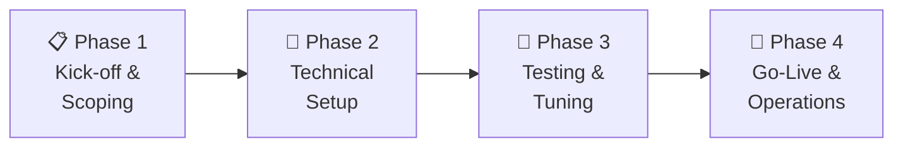

# Onboarding – SIEM Plus

## Overview

The onboarding process for the **SIEM Plus** Managed Service is a structured process that gets you up and running quickly and securely.

---

## Onboarding Phases

---

### Phase 1 – Kick-off & Scoping

| Activity | Details |
|---|---|
| **Kick-off Meeting** | Team introduction, timeline and communication channels |
| **Scope Definition** | Which systems and log sources should be monitored? |
| **Network Analysis** | Review of network prerequisites |
| **Points of Contact** | Designation of contacts on both sides |
| **SLA Agreement** | Definition of service levels and escalation paths |

**Result:** Documented scope and project plan

---

### Phase 2 – Technical Setup

| Activity | Details |
|---|---|
| **Platform Setup** | Configuration of your dedicated SIEM Plus environment |
| **Agent Rollout** | Installation of Wazuh Agents on your systems |
| **Log Integration** | Connection of additional log sources (firewalls, cloud, etc.) |
| **Base Ruleset** | Activation of the standard ruleset |
| **Dashboard Setup** | Configuration of customer-specific dashboards |
| **Access** | Provisioning of your dashboard credentials |

**Result:** Functional SIEM Plus platform with incoming data

---

### Phase 3 – Testing & Tuning

| Activity | Details |
|---|---|
| **Test Operation** | Monitoring of incoming alerts in parallel operation |
| **False Positive Tuning** | Rule adjustment to reduce false alarms |
| **Custom Rules** | Creation of customer-specific detection rules |
| **Playbook Customization** | Configuration of automated workflows |
| **Validation** | Verification of all integrations and data flows |

**Result:** Optimized configuration with minimal false positives

---

### Phase 4 – Go-Live & Transition to Operations

| Activity | Details |
|---|---|
| **Go-Live** | Activation of productive monitoring |
| **Training** | Introduction of your team to dashboard and processes |
| **Documentation** | Handover of operational documentation |
| **Review** | First review after 4 weeks of operation |

**Result:** Fully operational SIEM Plus Managed Service

---

## Customer-Side Prerequisites

!!! note "Checklist"
    - [ ] Technical point of contact designated
    - [ ] Network access configured (TCP 1514 outbound)
    - [ ] List of systems to be monitored provided
    - [ ] Administrative access for agent installation available
    - [ ] Escalation contact details provided

---

## Timeline

| Phase | Duration (typical) |
|---|---|
| Phase 1 – Kick-off & Scoping | 1 week |
| Phase 2 – Technical Setup | 1–2 weeks |
| Phase 3 – Testing & Tuning | 2–4 weeks |
| Phase 4 – Go-Live | 1 week |
| **Total** | **5–8 weeks** |

---

## Further Reading

- [SIEM Plus Service](siem-plus.md) – Service scope in detail
- [System Architecture](../architecture.md) – Technical overview
