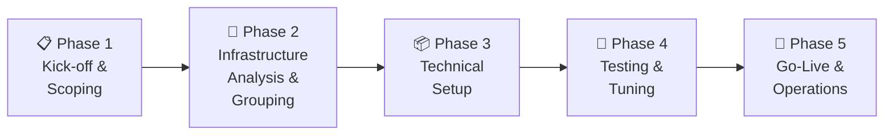
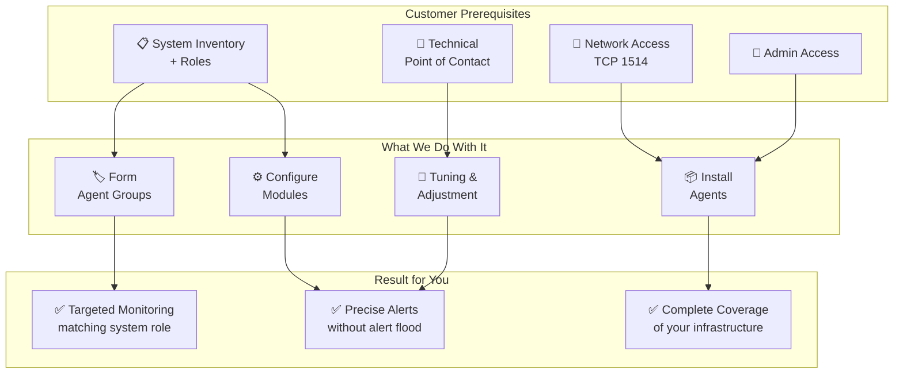

# Onboarding – SIEM Plus

## Overview

The onboarding process for the **SIEM Plus** Managed Service is a structured process that gets you up and running quickly and securely. We work closely with you throughout – because the quality of monitoring depends directly on how well we understand your infrastructure.

!!! info "Core Idea"
    Every prerequisite we need from you has a concrete reason. On this page we explain not only **what** we need, but also **why** – so you can understand the connection between your input and the result.

---

## Onboarding Phases


```mermaid
graph LR
    P1["📋 Phase 1<br/>Kick-off &<br/>Scoping"] --> P2["🔧 Phase 2<br/>Infrastructure<br/>Analysis &<br/>Grouping"]
    P2 --> P3["📦 Phase 3<br/>Technical<br/>Setup"]
    P3 --> P4["🧪 Phase 4<br/>Testing &<br/>Tuning"]
    P4 --> P5["🚀 Phase 5<br/>Go-Live &<br/>Operations"]
```

---

### Phase 1 – Kick-off & Scoping

| Activity | Details |
|---|---|
| **Kick-off Meeting** | Team introduction, timeline and communication channels |
| **Scope Definition** | Which systems and log sources should be monitored? |
| **Network Analysis** | Review of network prerequisites (TCP 1514 outbound) |
| **Points of Contact** | Designation of contacts on both sides |
| **SLA Agreement** | Definition of service levels and escalation paths |

**Result:** Documented scope and project plan

---

### Phase 2 – Infrastructure Analysis & Grouping

!!! tip "New Phase – Why?"
    This phase is crucial for the quality of your monitoring. Here we jointly define how your systems are grouped and which modules are activated. Learn more under [Agent Groups](../systems/siem-wazuh.md#agent-groups-the-central-configuration-concept).

| Activity | Details | Why? |
|---|---|---|
| **System Inventory** | Record all systems with hostname, OS and role | Without an inventory we don't know **which** systems need to be monitored |
| **Role Assignment** | Classification: DC, web server, DB, endpoint, network, … | The role determines which **modules** (FIM, SCA, rootkit, …) are activated |
| **Define Agent Groups** | Systems with the same role → same group | Enables **targeted configuration** instead of one-size-fits-all |
| **Module Planning per Group** | Define modules and rules per group | Avoids **blind spots** and **alert flood** simultaneously |
| **Criticality Assessment** | Which systems are business-critical? | Controls **alert priorities** and **escalation paths** |
| **Document Network Segments** | In which networks are the systems located? | Basis for rules detecting **lateral movement** |

**Result:** Documented agent group structure with module configuration per group

#### Example Result of This Phase

```
Agent Groups:
├── domain-controllers (2 systems)
│   └── Modules: Log Analysis, FIM, SCA (CIS Windows), Vuln Detection
├── webservers-linux (3 systems)
│   └── Modules: Log Analysis, FIM, Rootkit Detection, SCA (CIS Ubuntu), Active Response
├── databases (1 system)
│   └── Modules: Log Analysis, FIM, SCA (CIS PostgreSQL), Vuln Detection
├── endpoints-win (50 systems)
│   └── Modules: Log Analysis, SCA (CIS Windows), Vuln Detection
└── Syslog Input: Firewall (1 device)
    └── Firewall logs via Syslog
```

---

### Phase 3 – Technical Setup

| Activity | Details | Why? |
|---|---|---|
| **Platform Setup** | Configuration of your dedicated SIEM Plus environment | Dedicated instance for your data |
| **Create Agent Groups** | Configuration of groups in Wazuh Manager | Foundation for modular configuration |
| **Agent Rollout** | Installation of Wazuh Agents on your systems | The agent collects data directly on the system |
| **Group Assignment** | Each agent is assigned to its defined group | Only this way does each system receive the **right configuration** |
| **Log Integration** | Connection of additional log sources (firewalls, cloud, etc.) | Network devices send logs directly via syslog |
| **Dashboard Setup** | Configuration of group-specific dashboards | Overview per system role instead of unstructured data mass |
| **Access** | Provisioning of your dashboard credentials | Your direct access to your security posture |

**Result:** Functional SIEM Plus platform with incoming data and correct group assignment

---

### Phase 4 – Testing & Tuning

| Activity | Details | Why? |
|---|---|---|
| **Test Operation** | Monitoring of incoming alerts in parallel operation | Validation of configuration under real conditions |
| **False Positive Tuning** | Rule adjustment per group | Each system role produces **different** typical false positives |
| **Custom Rules** | Creation of customer-specific detection rules | Coverage of your **individual** threat scenarios |
| **Playbook Customization** | Configuration of automated workflows in Shuffle | Automated response to alerts from different groups |
| **Validation** | Check: Are all relevant events being detected? | Ensuring no **blind spots** exist |

**Result:** Optimized configuration with minimal false positives and maximum coverage

---

### Phase 5 – Go-Live & Transition to Operations

| Activity | Details |
|---|---|
| **Go-Live** | Activation of productive monitoring |
| **Training** | Introduction of your team to dashboard, agent groups and processes |
| **Documentation** | Handover of operational documentation including agent group overview |
| **Review** | First review after 4 weeks of operation – adjustments as needed |

**Result:** Fully operational SIEM Plus Managed Service

---

## Customer-Side Prerequisites – And Why

Every prerequisite serves a concrete purpose in the onboarding process:

| Prerequisite | What Exactly? | Why? | Needed in Phase |
|---|---|---|---|
| **Technical Point of Contact** | Person with infrastructure knowledge | Essential for queries about the system landscape and **group formation** | Phase 1–4 |
| **System Inventory** | List of all systems with hostname, OS and **role** | Without an inventory, neither **agent groups** can be formed nor modules selected | Phase 2 |
| **Role Assignment** | Function of each system (DC, web server, DB, …) | Determines the **module configuration** – a DC needs different monitoring than a workstation | Phase 2 |
| **Network Access TCP 1514** | Outbound connection to our platform | The agent must be able to transmit its data **encrypted** to the Wazuh Manager | Phase 3 |
| **Admin Access** | Local admin / root on target systems | Agent must be **installed as a service** and needs read access to logs | Phase 3 |
| **Criticality Assessment** | Which systems are business-critical? | Controls **alert priorities** – a DC alert has different urgency than a test system | Phase 2 |
| **Escalation Contacts** | Contact details for incidents | For critical alerts we need to be able to **reach you quickly** | Phase 1 |


```mermaid
graph TB
    subgraph "Customer Prerequisites"
        V1["📋 System Inventory<br/>+ Roles"]
        V2["🔌 Network Access<br/>TCP 1514"]
        V3["🔑 Admin Access"]
        V4["👤 Technical<br/>Point of Contact"]
    end

    subgraph "What We Do With It"
        A1["🏷️ Form<br/>Agent Groups"]
        A2["⚙️ Configure<br/>Modules"]
        A3["📦 Install<br/>Agents"]
        A4["🔧 Tuning &<br/>Adjustment"]
    end

    subgraph "Result for You"
        E1["✅ Targeted Monitoring<br/>matching system role"]
        E2["✅ Precise Alerts<br/>without alert flood"]
        E3["✅ Complete Coverage<br/>of your infrastructure"]
    end

    V1 --> A1
    V1 --> A2
    V2 --> A3
    V3 --> A3
    V4 --> A4
    A1 --> E1
    A2 --> E2
    A3 --> E3
    A4 --> E2
```

---

## Timeline

| Phase | Duration (typical) |
|---|---|
| Phase 1 – Kick-off & Scoping | 1 week |
| Phase 2 – Infrastructure Analysis & Grouping | 1 week |
| Phase 3 – Technical Setup | 1–2 weeks |
| Phase 4 – Testing & Tuning | 2–4 weeks |
| Phase 5 – Go-Live | 1 week |
| **Total** | **6–9 weeks** |

---

## Further Reading

- [SIEM – Wazuh](../systems/siem-wazuh.md) – Agent Groups, modules and configuration concept in detail
- [SIEM Plus Service](siem-plus.md) – Service scope in detail
- [System Architecture](../architecture.md) – Technical overview
