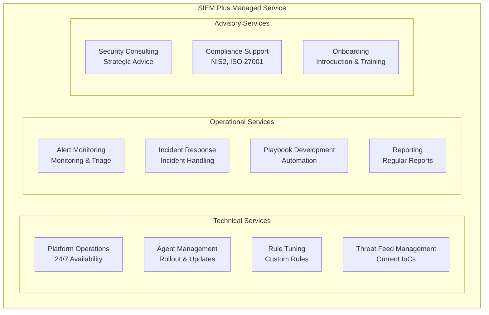
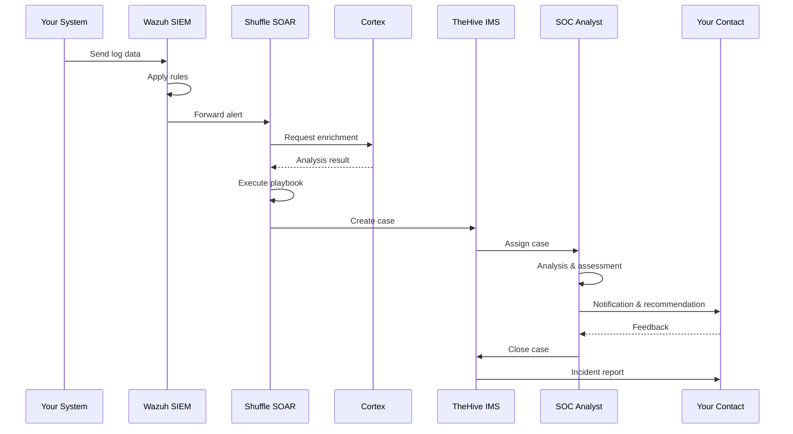

# Managed Service – SIEM Plus

## Overview

**SIEM Plus** is our comprehensive managed security service based on the open-source platform **Wazuh**, enhanced by the integration of TheHive/IRIS, MISP, Shuffle and Cortex to provide a complete Blue Team Operations stack.

!!! success "The Benefit for You"
    With SIEM Plus, you get a **full-fledged Security Operations Center (SOC)** – without the complexity and cost of building your own. We operate the technology, you keep the overview.

---

## What's Included in the Service?

### Platform Components

| Component | System | Included in Service |
|---|---|---|
| **SIEM** | [Wazuh](../systems/siem-wazuh.md) | ✅ Fully managed |
| **Incident Management** | [TheHive / IRIS](../systems/ims-thehive-iris.md) | ✅ Fully managed |
| **Threat Intelligence** | [MISP](../systems/tipl-misp.md) | ✅ Fully managed |
| **Automation** | [Shuffle](../systems/soar-shuffle.md) | ✅ Fully managed |
| **Enrichment** | [Cortex](../systems/cortex.md) | ✅ Fully managed |

### Service Deliverables

---

## Service Level

| Feature | Details |
|---|---|
| **Availability** | Platform available 24/7 |
| **Monitoring** | Continuous alert monitoring |
| **Incident Response** | Response according to agreed SLA |
| **Updates** | Regular platform and rule updates |
| **Reporting** | Monthly security report |

---

## What You Provide

For the SIEM Plus service, we need from your side:

| Task | Details |
|---|---|
| **Agent Installation** | Wazuh Agents on your systems (we support the rollout) |
| **Network Access** | Outbound connection to Wazuh Manager (TCP 1514) |
| **Point of Contact** | Technical contact for incident queries |
| **Log Sources** | Definition of systems and sources to be monitored |

---

## Typical Security Incident Flow

---

## Value Compared to Self-Operation

| Aspect | Self-Operation | SIEM Plus |
|---|---|---|
| **Personnel** | 3–5 SOC analysts needed | Included in service |
| **Setup Time** | 6–12 months | Weeks (onboarding) |
| **License Costs** | Commercial SIEM licenses | Open source – no license costs |
| **Threat Intelligence** | Source your own feeds | Curated feeds included |
| **Automation** | Develop your own playbooks | Proven playbooks included |
| **Know-how** | Build your own team | Experienced SOC team |
| **Scaling** | Procure hardware & licenses | Flexibly scalable |

---

## Next Steps

Interested in SIEM Plus? Here's how to proceed:

1. **Initial Meeting** – We analyze your requirements and IT landscape
2. **Proposal** – Individual offer based on your scope
3. **[Onboarding](onboarding.md)** – Structured introduction in a few weeks
4. **Operations** – Continuous managed service

---

## Further Reading

- [Onboarding Process](onboarding.md) – How the introduction works
- [System Architecture](../architecture.md) – Technical overview
- [Glossary](../glossary.md) – Technical terms explained
