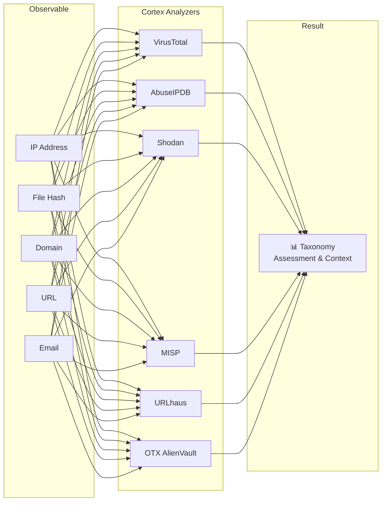
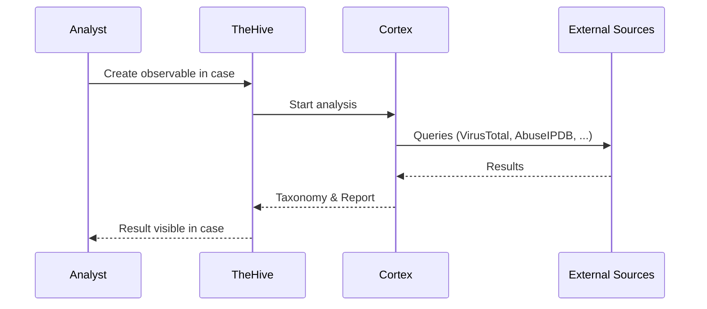

# Cortex – Enrichment & Response Engine

## What is Cortex?

**Cortex** is a powerful analysis and response engine that automatically checks suspicious indicators (such as IP addresses, file hashes or domains) against dozens of external data sources and analyzes them.

!!! tip "For Decision Makers"
    Cortex is like a **digital forensics assistant** – when a suspicious indicator appears, Cortex automatically checks it against dozens of databases and provides a well-founded assessment within seconds.

---

## Cortex at a Glance

| Property | Details |
|---|---|
| **Type** | Observable Analysis & Active Response Engine |
| **License** | Open Source (AGPL) |
| **Development** | StrangeBee (same developer as TheHive) |
| **Strengths** | 150+ analyzers, API-based, TheHive integration |
| **Use** | Automatic data enrichment and response |

---

## Core Features

### 1. Analyzers – Automatic Analysis

Cortex has **150+ analyzers** that check various observable types against external sources:

Commonly used analyzers:

| Analyzer | Checks | Observable Type |
|---|---|---|
| **VirusTotal** | Malware reputation | Hashes, URLs, domains, IPs |
| **AbuseIPDB** | IP reputation & abuse reports | IP addresses |
| **Shodan** | Open services & vulnerabilities | IP addresses |
| **MISP** | Threat intelligence database | All types |
| **URLhaus** | Known malware URLs | URLs |
| **OTX AlienVault** | Threat intelligence community | All types |
| **Yara** | Pattern-based file analysis | File hashes |

### 2. Responders – Automated Response

Besides analysis, Cortex can also actively respond:

- **Firewall Updates** – Block malicious IPs
- **DNS Sinkholing** – Redirect malicious domains
- **Mail Actions** – Remove phishing emails from mailboxes
- **Endpoint Actions** – Isolate affected systems

### 3. Taxonomy & Assessment

Analysis results are returned as standardized **taxonomies**:

| Level | Meaning | Example |
|---|---|---|
| `info` | Informational | "IP belongs to AWS" |
| `safe` | Benign | "Hash is known software" |
| `suspicious` | Suspicious | "Domain only 2 days old" |
| `malicious` | Malicious | "IP is known C2 server" |

---

## Integration with Other Systems

### Cortex ↔ TheHive (Primary Integration)

The closest integration is with **TheHive**:

- Observables in TheHive can be sent **directly** to Cortex for analysis
- Results appear as **reports** in the respective case
- Based on results, **responders** can be triggered

### Cortex ↔ Shuffle (SOAR)

- Shuffle uses Cortex analyzers in **automated workflows**
- Enrichment results feed into playbook **decision logic**

### Cortex ↔ MISP (TIPL)

- MISP serves as a **data source** for the MISP analyzer in Cortex
- Cortex results can flow back as new IoCs **to MISP**

---

## Benefits

| Aspect | Benefit |
|---|---|
| **Speed** | Parallel analysis with multiple sources in seconds |
| **Consistency** | Standardized assessment through taxonomies |
| **Coverage** | 150+ analyzers for comprehensive analysis |
| **Automation** | Fully API-driven, integrable into workflows |
| **Relief** | Analysts receive prepared results instead of raw data |

---

## Further Reading

- [IMS – TheHive/IRIS](ims-thehive-iris.md) – Primary integration platform
- [SOAR – Shuffle](soar-shuffle.md) – Uses Cortex in automated workflows
- [TIPL – MISP](tipl-misp.md) – Threat intelligence data source for Cortex
