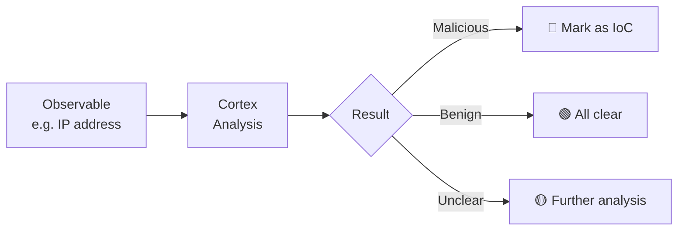
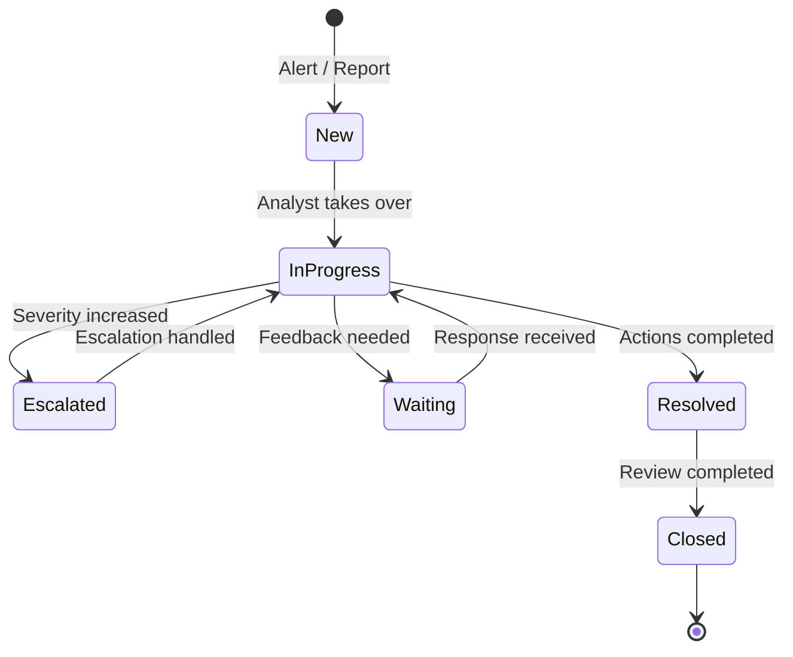

# IMS – TheHive & IRIS

## What is an Incident Management System?

An **Incident Management System (IMS)** is the central platform for handling security incidents. It enables structured documentation, collaboration and tracking – from the initial alert to full resolution.

!!! tip "For Decision Makers"
    The IMS is comparable to a **ticketing system for security incidents** – every incident is recorded as a case, assigned to a responsible person, processed and documented. Nothing gets lost and all measures are traceable.

---

## TheHive & IRIS at a Glance

We use **TheHive** and/or **IRIS** as our incident management platform:

### TheHive

| Property | Details |
|---|---|
| **Type** | Security Incident Response Platform |
| **License** | Open Source (AGPL) |
| **Strengths** | Case management, observables, task tracking, Cortex integration |
| **Use** | Collaborative incident handling in teams |

### IRIS (Incident Response Investigation System)

| Property | Details |
|---|---|
| **Type** | Incident Response Platform |
| **License** | Open Source |
| **Strengths** | Forensic investigations, timeline analysis, evidence management |
| **Use** | Detailed incident investigation |

---

## Core Features

### 1. Case Management

Every security incident is recorded as a **case** with:

- **Title & description** of the incident
- **Severity** (Low / Medium / High / Critical)
- **TLP** (Traffic Light Protocol) for information classification
- **Assignments** to responsible analysts
- **Tasks** – action items that need to be completed

### 2. Observables & IoC Tracking

Suspicious indicators are captured and tracked as **observables**:

- IP addresses
- Domains & URLs
- File hashes (MD5, SHA256)
- Email addresses
- Registry keys

### 3. Collaboration

- Multiple analysts work on cases simultaneously
- Comments and notes for every case
- Complete **audit trail** of all actions

### 4. Reporting

- Automatic generation of incident reports
- Export for compliance evidence
- Statistics on incident types and handling times

---

## Incident Lifecycle

---

## Integration with Other Systems

| System | Direction | Integration |
|---|---|---|
| **Shuffle (SOAR)** | → IMS | Automatic case creation from validated alerts |
| **Cortex** | ↔ IMS | Observable analysis directly from within cases |
| **MISP (TIPL)** | → IMS | Import IoCs from threat intelligence as observables |
| **Wazuh (SIEM)** | → IMS | Via Shuffle: alerts become cases |

---

## What You See as a Customer

- **Case Dashboard** – Overview of all current and past incidents
- **Incident Reports** – Detailed reports for every closed incident
- **Metrics** – Mean Time to Detect (MTTD), Mean Time to Respond (MTTR)
- **Notifications** – For new or escalated incidents

---

## Further Reading

- [Cortex](cortex.md) – Automatic analysis of observables
- [SOAR – Shuffle](soar-shuffle.md) – Automated case creation
- [System Architecture](../architecture.md) – Overall integration overview
