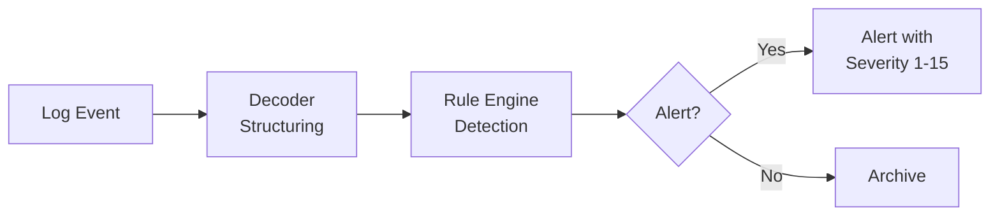
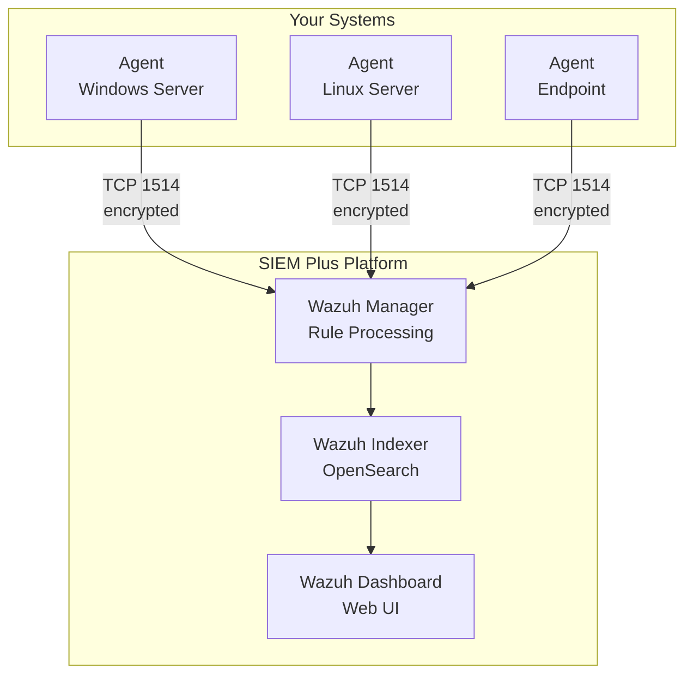

# SIEM – Wazuh

## What is a SIEM?

**SIEM** stands for **Security Information and Event Management**. A SIEM system collects security-relevant data from your entire IT infrastructure, correlates it and detects threats in real time.

!!! tip "For Decision Makers"
    Think of Wazuh as the **central alarm system** of your organization – it monitors all digital "doors and windows" and raises an alarm when something unusual happens.

---

## Why Wazuh?

Wazuh is an **open-source SIEM platform** used as the core system in our Managed SIEM Plus service:

| Property | Benefit |
|---|---|
| Open Source | No license costs, full transparency |
| Scalable | Grows with your infrastructure |
| Rule-based | Thousands of predefined detection rules |
| Compliance-ready | Supports PCI-DSS, GDPR, HIPAA, NIST |
| Agent-based | Detailed visibility into every monitored system |

---

## Core Features

### 1. Log Collection & Analysis

Wazuh collects logs from all connected systems via **agents**:

- Windows Event Logs
- Linux Syslog & Audit Logs
- Firewall & IDS/IPS Logs
- Application Logs
- Cloud Service Logs (AWS, Azure, GCP)

### 2. Threat Detection

- **Decoders** parse and structure raw log data
- The **Rule Engine** checks events against detection rules
- On matches, **alerts** with severity levels (1–15) are generated

### 3. File Integrity Monitoring (FIM)

Monitors critical files and directories for changes:

- Configuration files
- System binaries
- Sensitive data directories

### 4. Vulnerability Detection

Automatic scanning of installed software against known vulnerabilities (CVEs).

### 5. Compliance Monitoring

Continuous checking of system configuration against standards:

- **PCI-DSS** – Payment Card Industry
- **GDPR** – Data Protection
- **NIST 800-53** – US Security Standard
- **CIS Benchmarks** – Hardening Guidelines

---

## Architecture Components

| Component | Function |
|---|---|
| **Wazuh Agent** | Runs on monitored systems, collects and sends data |
| **Wazuh Manager** | Receives data, applies rules, generates alerts |
| **Wazuh Indexer** | Stores events (based on OpenSearch) |
| **Wazuh Dashboard** | Web interface for analysis and reporting |

---

## Integration with Other Systems

Wazuh is the **heart** of our Blue Team stack and feeds data to all other components:

- **→ Shuffle (SOAR):** Alerts are forwarded via webhook for automated response
- **← MISP (TIPL):** Threat intelligence feeds are integrated into Wazuh rules
- **→ TheHive/IRIS (IMS):** Validated alerts are created as cases via Shuffle

---

## What You See as a Customer

As part of the Managed SIEM Plus service, you receive:

- **Wazuh Dashboard** – Access to the web interface with your data
- **Custom Dashboards** – Views tailored to your needs
- **Regular Reports** – Security posture summaries
- **Alert Notifications** – You are notified of critical incidents

---

## Further Reading

- [System Architecture](../architecture.md) – How Wazuh works with other systems
- [SOAR – Shuffle](soar-shuffle.md) – Automated response to Wazuh alerts
- [SIEM Plus Service](../service/siem-plus.md) – Our managed service in detail
