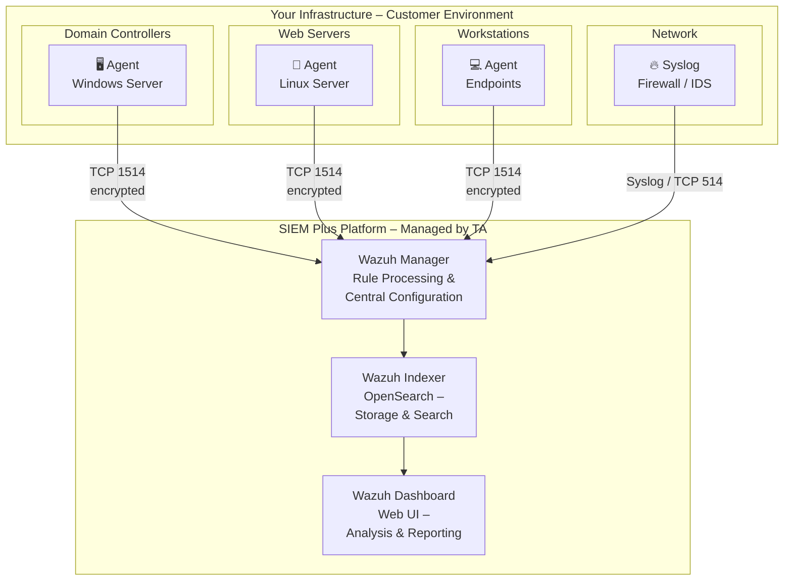
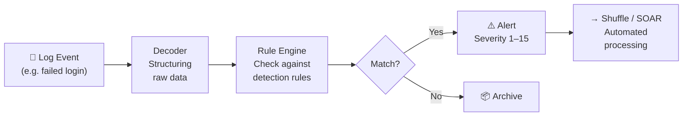
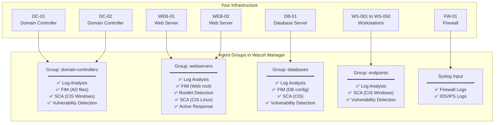
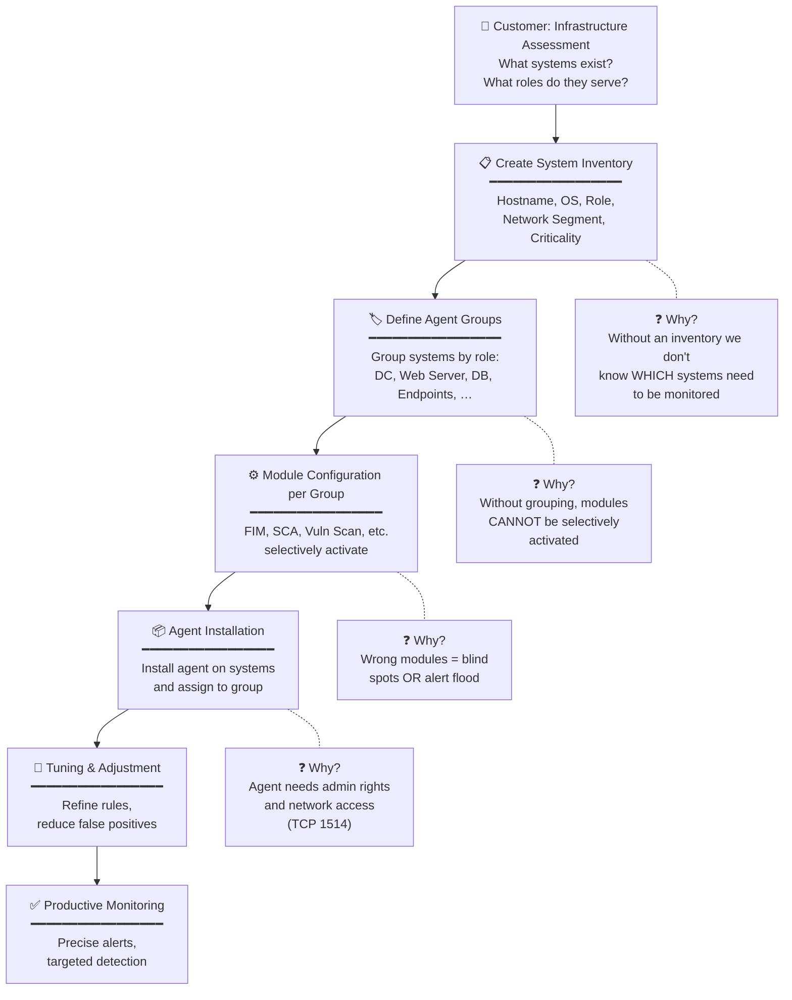
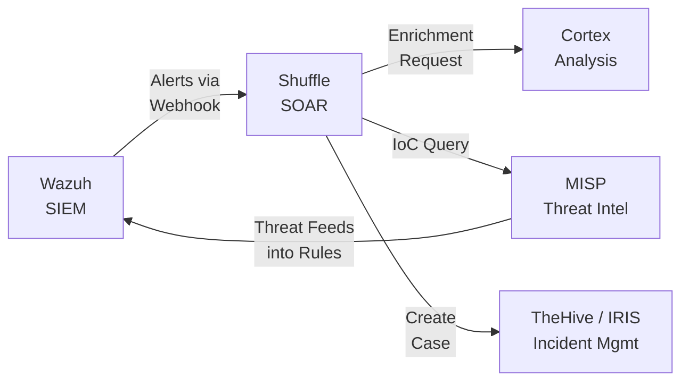

# SIEM – Wazuh

## What is a SIEM?

**SIEM** stands for **Security Information and Event Management**. A SIEM system collects security-relevant data from your entire IT infrastructure, correlates it and detects threats in real time.

!!! tip "For Decision Makers"
    Think of Wazuh as the **central alarm system** of your organization – it monitors all digital "doors and windows" and raises an alarm when something unusual happens. But unlike a simple alarm system, Wazuh can be **precisely configured**: each area of your organization gets exactly the monitoring it needs.

---

## Why Wazuh?

Wazuh is an **open-source SIEM platform** used as the core system in our Managed SIEM Plus service:

| Property | Benefit |
|---|---|
| Open Source | No license costs, full transparency |
| Scalable | Grows with your infrastructure |
| Rule-based | Thousands of predefined detection rules |
| Modular | Features are selectively activated per system group |
| Compliance-ready | Supports PCI-DSS, GDPR, HIPAA, NIST, ISO 27001 |
| Agent-based | Detailed visibility into every monitored system |

---

## Architecture Overview

Wazuh consists of four core components operated as a managed service by us – only the **agent** is installed on your side:

```mermaid
graph TB
    subgraph "Your Infrastructure – Customer Environment"
        subgraph "Domain Controllers"
            A1["🖥️ Agent<br/>Windows Server"]
        end
        subgraph "Web Servers"
            A2["🐧 Agent<br/>Linux Server"]
        end
        subgraph "Workstations"
            A3["💻 Agent<br/>Endpoints"]
        end
        subgraph "Network"
            FW["🔥 Syslog<br/>Firewall / IDS"]
        end
    end

    subgraph "SIEM Plus Platform – Managed by TA"
        M["Wazuh Manager<br/>Rule Processing &<br/>Central Configuration"]
        I["Wazuh Indexer<br/>OpenSearch –<br/>Storage & Search"]
        D["Wazuh Dashboard<br/>Web UI –<br/>Analysis & Reporting"]
    end

    A1 & A2 & A3 -->|"TCP 1514<br/>encrypted"| M
    FW -->|"Syslog / TCP 514"| M
    M --> I
    I --> D
```

| Component | Location | Function |
|---|---|---|
| **Wazuh Agent** | Your systems | Collects logs, monitors files, checks configurations |
| **Wazuh Manager** | Managed platform | Receives data, applies rules, manages agent configuration |
| **Wazuh Indexer** | Managed platform | Stores and indexes all events (OpenSearch) |
| **Wazuh Dashboard** | Managed platform | Web interface for analysis, search and reporting |

---

## Modules & Features

Wazuh has a **modular** architecture. Not every system needs every module – modules are **selectively activated per agent group**. This avoids unnecessary overhead and ensures detection is precisely tailored to each system's role.

### Module Overview

| Module | What It Does | Typical Use |
|---|---|---|
| **Log Data Analysis** | Collects and analyzes system and application logs | All systems |
| **File Integrity Monitoring (FIM)** | Detects changes to critical files | Servers, domain controllers |
| **Rootkit Detection** | Searches for hidden processes and files | Linux servers |
| **Security Configuration Assessment (SCA)** | Checks configurations against hardening standards (CIS) | Servers, endpoints |
| **Vulnerability Detection** | Scans installed software against known CVEs | All systems |
| **Active Response** | Automatic response to threats (e.g., IP blocking) | Exposed systems |
| **Compliance (PCI-DSS, GDPR, NIST)** | Continuous compliance checking | Systems in regulated areas |
| **Syslog Collection** | Receives logs from network devices (firewalls, switches) | Wazuh Manager (agentless) |

### Threat Detection in Detail

```mermaid
graph LR
    L["📄 Log Event<br/>(e.g. failed login)"] --> D["Decoder<br/>Structuring<br/>raw data"]
    D --> R["Rule Engine<br/>Check against<br/>detection rules"]
    R --> A{"Match?"}
    A -->|"Yes"| AL["⚠️ Alert<br/>Severity 1–15"]
    A -->|"No"| AR["📦 Archive"]
    AL --> S["→ Shuffle / SOAR<br/>Automated<br/>processing"]
```

- **Decoders** parse and structure raw log data into evaluable fields
- The **Rule Engine** checks events against thousands of detection rules
- On matches, **alerts** with severity levels (1–15) are generated
- Above a defined threshold, alerts are automatically forwarded to **Shuffle** for further processing

---

## Agent Groups – The Central Configuration Concept

!!! warning "Important for Customers"
    The correct assignment of your systems to **Agent Groups** is the most important prerequisite for effective monitoring. Without this assignment, we cannot activate the right modules.

### What Are Agent Groups?

Agent Groups are **logical groups** into which your systems are organized. Each group receives its **own configuration** – meaning its own set of activated modules, monitoring rules and thresholds.

```mermaid
graph TB
    subgraph "Your Infrastructure"
        DC1["DC-01<br/>Domain Controller"]
        DC2["DC-02<br/>Domain Controller"]
        WEB1["WEB-01<br/>Web Server"]
        WEB2["WEB-02<br/>Web Server"]
        DB1["DB-01<br/>Database Server"]
        WS1["WS-001 to WS-050<br/>Workstations"]
        FW1["FW-01<br/>Firewall"]
    end

    subgraph "Agent Groups in Wazuh Manager"
        G1["Group: domain-controllers<br/>━━━━━━━━━━━━━━━━━<br/>✅ Log Analysis<br/>✅ FIM (AD files)<br/>✅ SCA (CIS Windows)<br/>✅ Vulnerability Detection"]
        G2["Group: webservers<br/>━━━━━━━━━━━━━━━━━<br/>✅ Log Analysis<br/>✅ FIM (Web root)<br/>✅ Rootkit Detection<br/>✅ SCA (CIS Linux)<br/>✅ Active Response"]
        G3["Group: databases<br/>━━━━━━━━━━━━━━━━━<br/>✅ Log Analysis<br/>✅ FIM (DB config)<br/>✅ SCA (CIS)<br/>✅ Vulnerability Detection"]
        G4["Group: endpoints<br/>━━━━━━━━━━━━━━━━━<br/>✅ Log Analysis<br/>✅ SCA (CIS Windows)<br/>✅ Vulnerability Detection"]
        G5["Syslog Input<br/>━━━━━━━━━━━━━━━━━<br/>✅ Firewall Logs<br/>✅ IDS/IPS Logs"]
    end

    DC1 & DC2 --> G1
    WEB1 & WEB2 --> G2
    DB1 --> G3
    WS1 --> G4
    FW1 --> G5
```

### Why Is Correct Assignment So Important?

| Scenario | Problem | Consequence |
|---|---|---|
| Web server in "endpoints" group | No FIM for web root, no rootkit scan | Web shell attacks remain **undetected** |
| Domain controller without SCA | No hardening check against CIS benchmarks | AD misconfigurations remain **invisible** |
| Database server without FIM | No monitoring of DB configuration files | DB config manipulation goes **unnoticed** |
| All systems in one group | Identical configuration for everything | Too many irrelevant alerts (**alert fatigue**) or missing coverage |

!!! success "Core Principle"
    **Same role → Same group → Same monitoring.** Only when we know what function a system serves in your infrastructure can we activate the right modules and assign precise detection rules.

---

## Process Flow: From Infrastructure to Targeted Monitoring

The following process shows how we work together to get from your system landscape to optimally configured monitoring – and why each prerequisite is necessary.

```mermaid
graph TB
    START["🏢 Customer: Infrastructure Assessment<br/>What systems exist?<br/>What roles do they serve?"]

    INV["📋 Create System Inventory<br/>━━━━━━━━━━━━━━━━━<br/>Hostname, OS, Role,<br/>Network Segment, Criticality"]

    GROUP["🏷️ Define Agent Groups<br/>━━━━━━━━━━━━━━━━━<br/>Group systems by role:<br/>DC, Web Server, DB, Endpoints, …"]

    CONFIG["⚙️ Module Configuration per Group<br/>━━━━━━━━━━━━━━━━━<br/>FIM, SCA, Vuln Scan, etc.<br/>selectively activate"]

    DEPLOY["📦 Agent Installation<br/>━━━━━━━━━━━━━━━━━<br/>Install agent on systems<br/>and assign to group"]

    TUNE["🔧 Tuning & Adjustment<br/>━━━━━━━━━━━━━━━━━<br/>Refine rules,<br/>reduce false positives"]

    LIVE["✅ Productive Monitoring<br/>━━━━━━━━━━━━━━━━━<br/>Precise alerts,<br/>targeted detection"]

    START --> INV
    INV --> GROUP
    GROUP --> CONFIG
    CONFIG --> DEPLOY
    DEPLOY --> TUNE
    TUNE --> LIVE

    INV -.- N1["❓ Why?<br/>Without an inventory we don't<br/>know WHICH systems need<br/>to be monitored"]
    GROUP -.- N2["❓ Why?<br/>Without grouping, modules<br/>CANNOT be selectively<br/>activated"]
    CONFIG -.- N3["❓ Why?<br/>Wrong modules = blind<br/>spots OR alert flood"]
    DEPLOY -.- N4["❓ Why?<br/>Agent needs admin rights<br/>and network access<br/>(TCP 1514)"]
```

### What We Need from the Customer – And Why

| Prerequisite | What Exactly? | Why Is This Needed? |
|---|---|---|
| **System Inventory** | List of all systems to be monitored with hostname, OS and role | Without this information, we can neither form agent groups nor select the right modules |
| **Role Assignment** | What function does each system serve? (DC, web server, DB, endpoint, …) | The role determines which modules are activated – a web server needs different monitoring than a workstation |
| **Network Segmentation** | In which network segments are the systems located? | Enables creation of rules that detect abnormal network traffic between segments |
| **Network Access TCP 1514** | Outbound connection from all agents to the SIEM platform | The agent must be able to transmit its collected data encrypted to the Wazuh Manager |
| **Admin Access** | Local admin / root on the systems to be monitored | The agent must be installed as a service and needs read access to logs and system files |
| **Technical Point of Contact** | Person with infrastructure knowledge on the customer side | Essential for queries about the system landscape and during group formation |
| **Criticality Assessment** | Which systems are business-critical? | Determines alert priorities and escalation paths – an alert on the DC has different urgency than on a test system |

---

## Practical Example: Agent Groups in Action

Consider a mid-sized company with the following infrastructure:

=== "Infrastructure"

    | System | Count | Role |
    |---|---|---|
    | Windows Server 2022 | 2 | Active Directory Domain Controllers |
    | Ubuntu 22.04 | 3 | Web Servers (Apache) |
    | Ubuntu 22.04 | 1 | Database Server (PostgreSQL) |
    | Windows 11 | 50 | Workstations |
    | FortiGate 60F | 1 | Firewall |

=== "Agent Groups"

    | Group | Systems | Activated Modules |
    |---|---|---|
    | `domain-controllers` | DC-01, DC-02 | Log Analysis, FIM (NTDS.dit, GPO, SYSVOL), SCA (CIS Windows Server), Vulnerability Detection |
    | `webservers-linux` | WEB-01, WEB-02, WEB-03 | Log Analysis (Apache Access/Error), FIM (/var/www, /etc/apache2), Rootkit Detection, SCA (CIS Ubuntu), Active Response |
    | `databases` | DB-01 | Log Analysis (PostgreSQL), FIM (pg_hba.conf, postgresql.conf), SCA (CIS PostgreSQL), Vulnerability Detection |
    | `endpoints-win` | WS-001 to WS-050 | Log Analysis, SCA (CIS Windows 11), Vulnerability Detection |
    | *(Syslog Input)* | FortiGate | Firewall logs via Syslog to Wazuh Manager |

=== "Result"

    - **Domain controllers** are monitored for AD-specific attacks (Golden Ticket, DCSync, GPO manipulation)
    - **Web servers** are checked for web shells, rootkits and config changes
    - **Database server** is monitored for unauthorized configuration changes and known CVEs
    - **Workstations** are checked for malware indicators, software vulnerabilities and hardening gaps
    - **Firewall** provides network events for correlation with host-based alerts

---

## Integration with Other Systems

Wazuh is the **heart** of our Blue Team stack and feeds data to all other components:

```mermaid
graph LR
    W["Wazuh<br/>SIEM"] -->|"Alerts via<br/>Webhook"| SH["Shuffle<br/>SOAR"]
    SH -->|"Enrichment<br/>Request"| CO["Cortex<br/>Analysis"]
    SH -->|"IoC Query"| MI["MISP<br/>Threat Intel"]
    MI -->|"Threat Feeds<br/>into Rules"| W
    SH -->|"Create<br/>Case"| TH["TheHive / IRIS<br/>Incident Mgmt"]
```

| Integration | Direction | Description |
|---|---|---|
| **→ Shuffle (SOAR)** | Wazuh → Shuffle | Alerts forwarded via webhook for automated triage and response |
| **← MISP (TIPL)** | MISP → Wazuh | Threat intelligence feeds (IoCs) integrated into Wazuh rules |
| **→ TheHive/IRIS** | Shuffle → TheHive | Validated alerts created as cases with context |
| **↔ Cortex** | Shuffle ↔ Cortex | Enrichment of observables (IP, hash, domain) with threat data |

---

## What You See as a Customer

As part of the Managed SIEM Plus service, you receive:

- **Wazuh Dashboard** – Access to the web interface with your data
- **Custom Dashboards** – Views tailored to your system landscape (e.g., AD Health, Web Security, Compliance Status)
- **Agent Overview** – Status of all agents and their group assignments
- **Regular Reports** – Security posture summaries including compliance status
- **Alert Notifications** – You are notified of critical incidents through the agreed channel

---

## Further Reading

- [System Architecture](../architecture.md) – How Wazuh works with other systems
- [SOAR – Shuffle](soar-shuffle.md) – Automated response to Wazuh alerts
- [Onboarding](../service/onboarding.md) – The path from assessment to productive monitoring
- [SIEM Plus Service](../service/siem-plus.md) – Our managed service in detail
