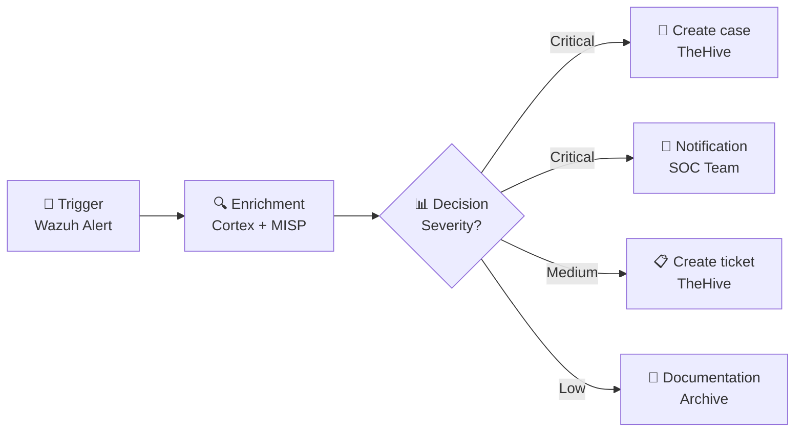
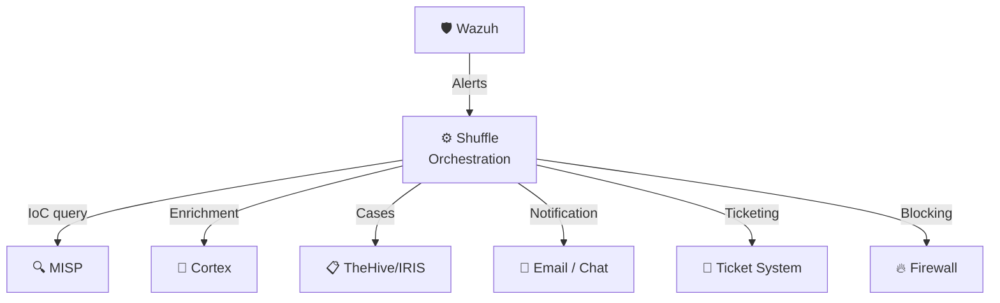

# SOAR – Shuffle

## What is SOAR?

**SOAR** stands for **Security Orchestration, Automation and Response**. A SOAR system connects various security tools and automates recurring processes – from alert to response.

!!! tip "For Decision Makers"
    Shuffle is the **conductor of our security orchestra** – it coordinates all systems, ensures information flows automatically, and responds to threats within seconds instead of hours.

---

## Shuffle at a Glance

**Shuffle** is an open-source SOAR platform specifically designed for security operations:

| Property | Details |
|---|---|
| **Type** | Security Orchestration, Automation & Response |
| **License** | Open Source (AGPL) |
| **Strengths** | Visual workflow editor, broad API integration, no-code approach |
| **Use** | Automation of security processes |

---

## Core Features

### 1. Workflow Automation (Playbooks)

Shuffle automates security processes through **visual workflows**:

Typical automated workflows:

| Workflow | Trigger | Actions |
|---|---|---|
| **Alert Triage** | New Wazuh alert | IoC check in MISP, enrichment via Cortex, create case |
| **Phishing Response** | Phishing report | URL analysis, sender check, mailbox scan, blocking |
| **Malware Detection** | File hash alert | Hash check in MISP, sandbox analysis, endpoint isolation |
| **Brute Force Response** | Login anomaly | IP reputation check, lock account, create case |

### 2. Orchestration

Shuffle connects all systems via **APIs** and acts as a central integration platform:

### 3. Response Actions

Automated responses to detected threats:

- **Blocking** – Block IP addresses on firewalls
- **Isolation** – Isolate compromised endpoints
- **Account Lockout** – Disable affected user accounts
- **Notification** – Inform stakeholders via email, Slack or Teams
- **Documentation** – Automatic creation of incident reports

### 4. Metrics & Reporting

- **Mean Time to Respond (MTTR)** – Average response time
- **Automation Rate** – Percentage of automatically handled alerts
- **Workflow Statistics** – Execution frequency and success rates

---

## Benefits of Automation

| Without SOAR | With Shuffle |
|---|---|
| Manual review of every alert | Automatic triage and enrichment |
| Minutes to hours response time | Seconds response time |
| Analyst time spent on routine tasks | Analysts focus on complex cases |
| Inconsistent processes | Standardized, repeatable playbooks |
| Fragmented tool landscape | Central orchestration of all tools |

---

## Integration with Other Systems

| System | Direction | Integration |
|---|---|---|
| **Wazuh (SIEM)** | SIEM → Shuffle | Receive alerts via webhook |
| **MISP (TIPL)** | Shuffle ↔ MISP | IoC queries and feed updates |
| **Cortex** | Shuffle → Cortex | Enrichment requests for observables |
| **TheHive/IRIS (IMS)** | Shuffle → IMS | Automatic case creation |

---

## What You Get as a Customer

- **Faster response** – Threats are handled in seconds instead of hours
- **Fewer false alarms** – Automatic pre-analysis reduces false positives
- **Transparency** – All automated actions are documented traceably
- **Consistency** – Every alert is processed following the same procedure

---

## Further Reading

- [SIEM – Wazuh](siem-wazuh.md) – The alert source for Shuffle
- [Cortex](cortex.md) – Enrichment engine for Shuffle workflows
- [IMS – TheHive/IRIS](ims-thehive-iris.md) – Target for automated case creation
