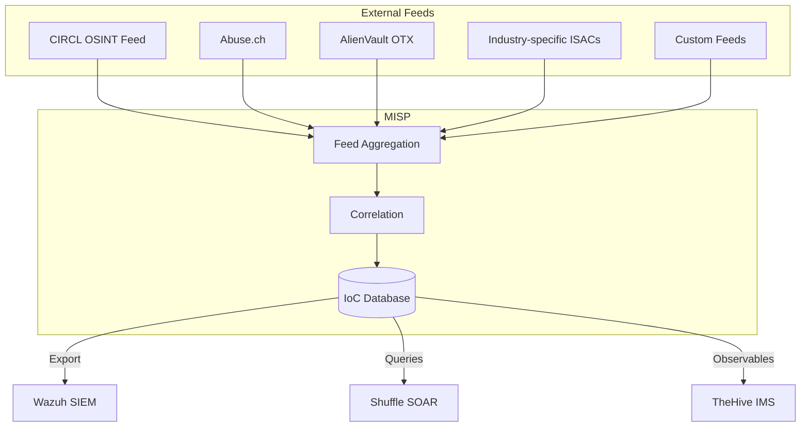

# TIPL – MISP

## What is a Threat Intelligence Platform?

A **Threat Intelligence Platform (TIPL)** collects, processes and shares information about current cyber threats – known as **Indicators of Compromise (IoCs)**. This information helps detect and respond to attacks more quickly.

!!! tip "For Decision Makers"
    MISP is like an **intelligence service for cyber threats** – it collects current information worldwide about known attack patterns, malicious IP addresses and malware, and makes this information available to our detection systems.

---

## MISP at a Glance

**MISP** (Malware Information Sharing Platform & Threat Sharing) is the leading open-source platform for threat intelligence:

| Property | Details |
|---|---|
| **Type** | Threat Intelligence Platform |
| **License** | Open Source (AGPL) |
| **Development** | CIRCL (Computer Incident Response Center Luxembourg) |
| **Strengths** | IoC management, community sharing, feed aggregation |
| **Standard** | MISP format is the de-facto standard for threat intelligence |

---

## Core Features

### 1. IoC Management

MISP manages various types of Indicators of Compromise:

| IoC Type | Example | Detection |
|---|---|---|
| IP Addresses | `192.168.1.100` (C2 server) | Network communication |
| Domains | `evil-domain.com` | DNS queries |
| File Hashes | `a1b2c3d4...` (SHA256) | Malware detection |
| URLs | `https://phishing.example/login` | Web traffic |
| Email Addresses | `attacker@evil.com` | Phishing detection |
| YARA Rules | Pattern-based detection | File analysis |

### 2. Threat Feeds

MISP aggregates threat information from multiple sources:

### 3. Event-based Organization

Threats are organized in MISP as **events**:

- **Event** – A security incident or campaign (e.g., "Emotet Campaign Q1 2026")
- **Attributes** – Individual IoCs within an event
- **Objects** – Structured summary of multiple attributes
- **Galaxies** – Categorization by threat actor, malware family, attack pattern (MITRE ATT&CK)
- **Tags** – Flexible labeling (TLP, confidence level)

### 4. Sharing & Communities

MISP enables controlled sharing of threat intelligence:

- **Sharing Groups** – Defined recipient groups
- **TLP Markings** – Controlled distribution (TLP:RED to TLP:CLEAR)
- **Synchronization** – Automatic exchange between MISP instances
- **ISAC Integration** – Industry-specific sharing communities

---

## Integration with Other Systems

| System | Integration | Benefit |
|---|---|---|
| **Wazuh (SIEM)** | IoC export as CDB lists | Real-time detection of known threats in logs |
| **Shuffle (SOAR)** | REST API queries | Automatic IoC checks in playbooks |
| **TheHive/IRIS (IMS)** | Observable import | Enrichment of cases with threat context |
| **Cortex** | Analyzer integration | MISP as data source for Cortex analyses |

---

## Value for Your Organization

### Proactive Protection

- Known threats are **automatically detected** before they cause damage
- Industry-specific feeds ensure **relevant** threat intelligence
- New IoCs are integrated into detection within minutes

### Compliance & Reporting

- Documentation of threat intelligence sources used
- Traceable decision-making basis for incidents
- Reporting on detected threats and their sources

---

## Further Reading

- [SIEM – Wazuh](siem-wazuh.md) – How MISP IoCs are used in detection
- [SOAR – Shuffle](soar-shuffle.md) – Automatic IoC checks in workflows
- [Glossary](../glossary.md) – Explanation of terms like IoC, TLP, ISAC
