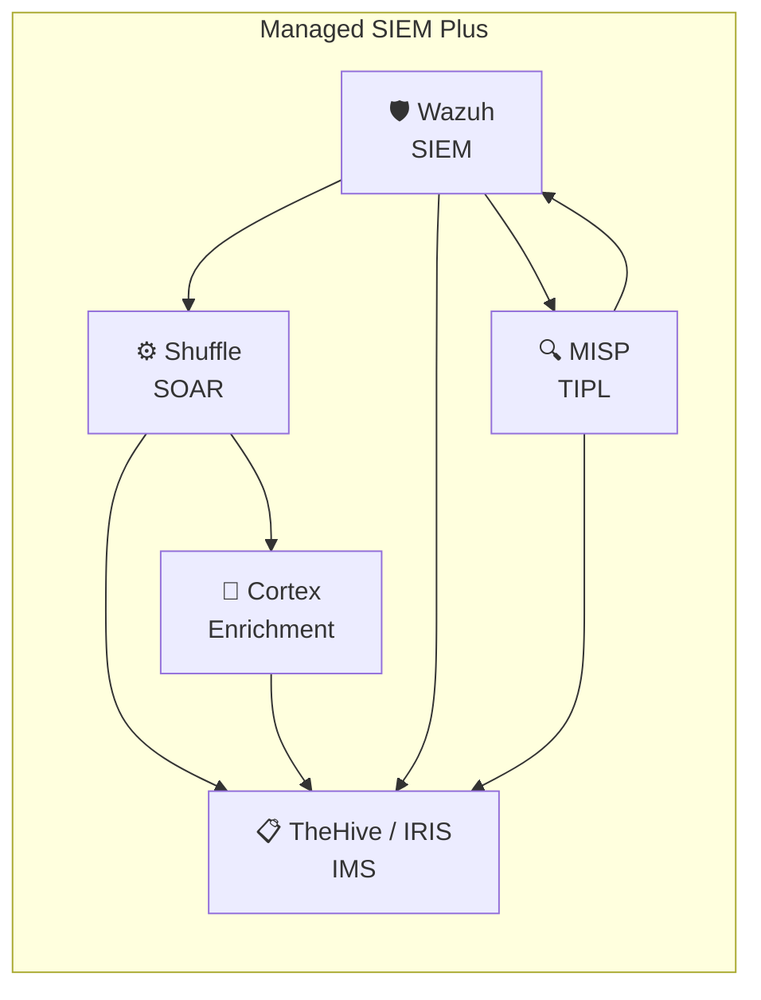

# Blue Team Operations – Wissensdatenbank

Willkommen im Kundenportal für **Blue Team Operations**. Diese Wissensdatenbank bietet Ihnen einen umfassenden Überblick über die Systeme und Prozesse, die im Rahmen unseres **Managed SIEM Plus Service** zum Einsatz kommen.

---

## Für wen ist dieses Wiki?

| Zielgruppe | Was Sie hier finden |
|---|---|
| **Entscheidungsträger** | Strategischer Überblick, Mehrwert der Systeme, Service-Beschreibung |
| **Technische Ansprechpartner** | Systemarchitektur, Integrationen, technische Details |

---

## Unsere Plattform im Überblick

---

## Schnelleinstieg

-   :material-shield-search: **[Blue Team Operations Überblick](de/ueberblick.md)**

    Was ist Blue Teaming und warum ist es entscheidend?

-   :material-sitemap: **[Systemarchitektur](de/architektur.md)**

    Wie unsere Systeme zusammenarbeiten

-   :material-server-security: **[SIEM Plus Service](de/service/siem-plus.md)**

    Unser Managed Service im Detail

-   :material-book-alphabet: **[Glossar](de/glossar.md)**

    Fachbegriffe einfach erklärt

---

## Die Systeme

| Abkürzung | System | Produkt | Funktion |
|---|---|---|---|
| **SIEM** | Security Information & Event Management | Wazuh | Zentrale Logsammlung, Erkennung & Analyse |
| **IMS** | Incident Management System | TheHive / IRIS | Vorfallbearbeitung & Fallmanagement |
| **TIPL** | Threat Intelligence Platform | MISP | Bedrohungsinformationen sammeln & teilen |
| **SOAR** | Security Orchestration, Automation & Response | Shuffle | Automatisierung von Sicherheitsprozessen |
| **Cortex** | Enrichment & Response Engine | Cortex | Datenanreicherung & automatisierte Reaktion |

---

*🌐 [Switch to English](en/overview.md)*
